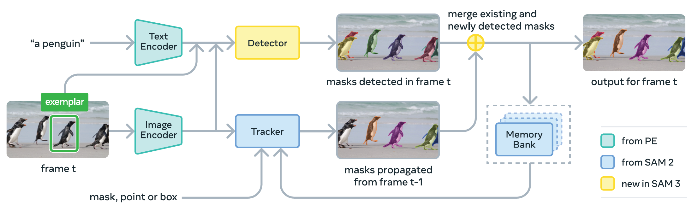

论文标题：《[SAM 3: Segment Anything with Concepts](https://ai.meta.com/research/publications/sam-3-segment-anything-with-concepts/)》【[GitHub](https://github.com/facebookresearch/sam3?tab=readme-ov-file)】

## 论文动机与创新

SAM系列提出了可提示分割任务，即基于点、框或掩码来对每次提示分割单个目标。虽然这些方法取得了突破性的进展，但它们并未解决一个更通用的问题：**在输入中找到并分割某一概念的所有实例**。

针对这个问题，该论文定义了一个新的任务——**可提示概念分割（Promptable Concept Segmentation, PCS）**，具体定义为给定一张图像或一段短视频（≤30 秒），根据由**短文本短语**、**图像示例**或两者组合指定的视觉概念，**检测、分割并跟踪该概念的所有实例**。短文本短语为简单名词短语（noun phrases, NPs），即由一个名词及可选的修饰语组成。当提供**文本名词短语**时，它作为整个图像/视频所有帧的全局提示；而**图像示例**可以在单独的帧上以正/负样本形式的 bounding boxes 输入，用于迭代式地精细化目标掩码。



## 模型的结构与训练

### 模型代码实现（图像输入）

#### SAM3运行数据流

在设置好模型运行环境后，模型使用参考命令如下：

```python
from PIL import Image
from sam3.model_builder import build_sam3_image_model
from sam3.model.sam3_image_processor import Sam3Processor
# Load the model
model = build_sam3_image_model()
processor = Sam3Processor(model)
# Load an image
image = Image.open("<YOUR_IMAGE_PATH.jpg>")
inference_state = processor.set_image(image)
# Prompt the model with text
output = processor.set_text_prompt(state=inference_state, prompt="<YOUR_TEXT_PROMPT>")

# Get the masks, bounding boxes, and scores
masks, boxes, scores = output["masks"], output["boxes"], output["scores"]
```

##### Sam3Processor的实现

此处选取了调用了的部分代码实现，请结合SAM3模块组成介绍理解注释。

```python
class Sam3Processor:
    def __init__(self, model, resolution=1008, device="cuda", confidence_threshold=0.5):
        self.model = model
        self.resolution = resolution
        self.device = device
        self.transform = v2.Compose(
            [
                v2.ToDtype(torch.uint8, scale=True),
                v2.Resize(size=(resolution, resolution)),
                v2.ToDtype(torch.float32, scale=True),
                v2.Normalize(mean=[0.5, 0.5, 0.5], std=[0.5, 0.5, 0.5]),
            ]
        )
        self.confidence_threshold = confidence_threshold

        self.find_stage = FindStage(
            img_ids=torch.tensor([0], device=device, dtype=torch.long),
            text_ids=torch.tensor([0], device=device, dtype=torch.long),
            input_boxes=None,
            input_boxes_mask=None,
            input_boxes_label=None,
            input_points=None,
            input_points_mask=None,
        )

    @torch.inference_mode()
    def set_image(self, image, state=None):
        """
        使用SAM3：Vision Encoder处理输入图像
        
        输入：
        	image：目标图片
        	state：用于存储运行途中的重要数据，初始为空
        	
        输出：字典state
        	original_height：输入图像的高
        	original_width：输入图像的宽
        	backbone_out：用于存放Vision Encoder的输出的字典
        		vision_features：最高尺度语义信息
        		vision_pos_enc：所有尺度图像特征对应的位置编码
        		backbone_fpn：所有尺度的图像特征
        """
        if state is None:
            state = {}

        if isinstance(image, PIL.Image.Image):
            width, height = image.size
        elif isinstance(image, (torch.Tensor, np.ndarray)):
            height, width = image.shape[-2:]
        else:
            raise ValueError("Image must be a PIL image or a tensor")

        image = v2.functional.to_image(image).to(self.device)
        image = self.transform(image).unsqueeze(0)

        state["original_height"] = height
        state["original_width"] = width
        state["backbone_out"] = self.model.backbone.forward_image(image)
        inst_interactivity_en = self.model.inst_interactive_predictor is not None
        if inst_interactivity_en and "sam2_backbone_out" in state["backbone_out"]:
            sam2_backbone_out = state["backbone_out"]["sam2_backbone_out"]
            sam2_backbone_out["backbone_fpn"][0] = (
                self.model.inst_interactive_predictor.model.sam_mask_decoder.conv_s0(
                    sam2_backbone_out["backbone_fpn"][0]
                )
            )
            sam2_backbone_out["backbone_fpn"][1] = (
                self.model.inst_interactive_predictor.model.sam_mask_decoder.conv_s1(
                    sam2_backbone_out["backbone_fpn"][1]
                )
            )
        return state
    
    @torch.inference_mode()
    def set_text_prompt(self, prompt: str, state: Dict):
        """
        结合处理图片得到的输出特征backbone_out和输入的文本提示prompt进行处理
        
        输入：
        	prompt：文本提示
        	state：存储重要数据的字典
        	
        输出：
        	self._forward_grounding函数的输出
        """

        if "backbone_out" not in state:
            raise ValueError("You must call set_image before set_text_prompt")

        text_outputs = self.model.backbone.forward_text([prompt], device=self.device)
        # 更新/添加state字典中关于文本提示的相关信息
        state["backbone_out"].update(text_outputs)
        # 更新/添加state字典中关于几何提示的相关信息
        # self.model._get_dummy_prompt用于提供占位的几何提示框，无具体信息
        if "geometric_prompt" not in state:
            state["geometric_prompt"] = self.model._get_dummy_prompt()

        return self._forward_grounding(state)
    
    @torch.inference_mode()
    def _forward_grounding(self, state: Dict):
        """
        获取模型输出结果并进行处理
        
        """
        # 参考Sam3Image中的forward_grounding函数
        outputs = self.model.forward_grounding(
            backbone_out=state["backbone_out"],
            find_input=self.find_stage,
            geometric_prompt=state["geometric_prompt"],
            find_target=None,
        )

        out_bbox = outputs["pred_boxes"]
        out_logits = outputs["pred_logits"]
        out_masks = outputs["pred_masks"]
        out_probs = out_logits.sigmoid()
        presence_score = outputs["presence_logit_dec"].sigmoid().unsqueeze(1)
        out_probs = (out_probs * presence_score).squeeze(-1)

        keep = out_probs > self.confidence_threshold
        out_probs = out_probs[keep]
        out_masks = out_masks[keep]
        out_bbox = out_bbox[keep]

        # convert to [x0, y0, x1, y1] format
        boxes = box_ops.box_cxcywh_to_xyxy(out_bbox)

        img_h = state["original_height"]
        img_w = state["original_width"]
        scale_fct = torch.tensor([img_w, img_h, img_w, img_h]).to(self.device)
        boxes = boxes * scale_fct[None, :]

        out_masks = interpolate(
            out_masks.unsqueeze(1),
            (img_h, img_w),
            mode="bilinear",
            align_corners=False,
        ).sigmoid()

        state["masks_logits"] = out_masks
        state["masks"] = out_masks > 0.5
        state["boxes"] = boxes
        state["scores"] = out_probs
        return state
```

##### Sam3Image的实现

该部分为模型本体的定义，并且提供了调用模型中各模块处理的函数。此处也仅选取调用了的函数。

```python
class Sam3Image(torch.nn.Module):
    TEXT_ID_FOR_TEXT = 0
    TEXT_ID_FOR_VISUAL = 1
    TEXT_ID_FOR_GEOMETRIC = 2

    def __init__(
        self,
        backbone: SAM3VLBackbone,
        transformer,
        input_geometry_encoder,
        segmentation_head=None,
        num_feature_levels=1,
        o2m_mask_predict=True,
        dot_prod_scoring=None,
        use_instance_query: bool = True,
        multimask_output: bool = True,
        use_act_checkpoint_seg_head: bool = True,
        interactivity_in_encoder: bool = True,
        matcher=None,
        use_dot_prod_scoring=True,
        supervise_joint_box_scores: bool = False,  # only relevant if using presence token/score
        detach_presence_in_joint_score: bool = False,  # only relevant if using presence token/score
        separate_scorer_for_instance: bool = False,
        num_interactive_steps_val: int = 0,
        inst_interactive_predictor: SAM3InteractiveImagePredictor = None,
        **kwargs,
    ):
        super().__init__()
        self.backbone = backbone
        self.geometry_encoder = input_geometry_encoder
        self.transformer = transformer
        self.hidden_dim = transformer.d_model
        self.num_feature_levels = num_feature_levels
        self.segmentation_head = segmentation_head

        self.o2m_mask_predict = o2m_mask_predict

        self.dot_prod_scoring = dot_prod_scoring
        self.use_act_checkpoint_seg_head = use_act_checkpoint_seg_head
        self.interactivity_in_encoder = interactivity_in_encoder
        self.matcher = matcher

        self.num_interactive_steps_val = num_interactive_steps_val
        self.use_dot_prod_scoring = use_dot_prod_scoring

        if self.use_dot_prod_scoring:
            assert dot_prod_scoring is not None
            self.dot_prod_scoring = dot_prod_scoring
            self.instance_dot_prod_scoring = None
            if separate_scorer_for_instance:
                self.instance_dot_prod_scoring = deepcopy(dot_prod_scoring)
        else:
            self.class_embed = torch.nn.Linear(self.hidden_dim, 1)
            self.instance_class_embed = None
            if separate_scorer_for_instance:
                self.instance_class_embed = deepcopy(self.class_embed)

        self.supervise_joint_box_scores = supervise_joint_box_scores
        self.detach_presence_in_joint_score = detach_presence_in_joint_score

        # verify the number of queries for O2O and O2M
        num_o2o_static = self.transformer.decoder.num_queries
        num_o2m_static = self.transformer.decoder.num_o2m_queries
        assert num_o2m_static == (num_o2o_static if self.transformer.decoder.dac else 0)
        self.dac = self.transformer.decoder.dac

        self.use_instance_query = use_instance_query
        self.multimask_output = multimask_output

        self.inst_interactive_predictor = inst_interactive_predictor

    @property
    def device(self):
        self._device = getattr(self, "_device", None) or next(self.parameters()).device
        return self._device

    def to(self, *args, **kwargs):
        # clear cached _device in case the model is moved to a different device
        self._device = None
        return super().to(*args, **kwargs)

    def _get_img_feats(self, backbone_out, img_ids):
        """
        根据给定的 img_ids，从 backbone 的输出中取出（或在必要时重新计算）对应图像的多尺度视觉特征及其位置编码，并统一整理成 Transformer 可直接使用的序列形式。
        """
        if "backbone_fpn" in backbone_out:
            if "id_mapping" in backbone_out and backbone_out["id_mapping"] is not None:
                img_ids = backbone_out["id_mapping"][img_ids]
                # If this assert fails, it likely means we're requesting different img_ids (perhaps a different frame?)
                # We currently don't expect this to happen. We could technically trigger a recompute here,
                # but likely at the cost of a cpu<->gpu sync point, which would deteriorate perf
                torch._assert_async((img_ids >= 0).all())

            vis_feats = backbone_out["backbone_fpn"][-self.num_feature_levels :]
            vis_pos_enc = backbone_out["vision_pos_enc"][-self.num_feature_levels :]
            vis_feat_sizes = [x.shape[-2:] for x in vis_pos_enc]  # (H, W) shapes
            # index and flatten visual features NxCxHxW => HWxNxC (batch-first => seq-first)
            img_feats = [x[img_ids].flatten(2).permute(2, 0, 1) for x in vis_feats]
            img_pos_embeds = [
                x[img_ids].flatten(2).permute(2, 0, 1) for x in vis_pos_enc
            ]
            return backbone_out, img_feats, img_pos_embeds, vis_feat_sizes

        # Image features not available in backbone output, so we compute them on the fly
        # This case likely occurs for video. In that case, we want to forward only the current frame
        img_batch = backbone_out["img_batch_all_stages"]
        if img_ids.numel() > 1:
            # Only forward backbone on unique image ids to avoid repetitive computation
            unique_ids, _ = torch.unique(img_ids, return_inverse=True)
        else:
            unique_ids, _ = img_ids, slice(None)
        # Compute the image features on those unique image ids
        # note: we allow using a list (or other indexable types) of tensors as img_batch
        # (e.g. for async frame loading in demo). In this case we index img_batch.tensors directly
        if isinstance(img_batch, torch.Tensor):
            image = img_batch[unique_ids]
        elif unique_ids.numel() == 1:
            image = img_batch[unique_ids.item()].unsqueeze(0)
        else:
            image = torch.stack([img_batch[i] for i in unique_ids.tolist()])
        # `img_batch` might be fp16 and offloaded to CPU
        image = image.to(dtype=torch.float32, device=self.device)
        # Next time we call this function, we want to remember which indices we computed
        id_mapping = torch.full(
            (len(img_batch),), -1, dtype=torch.long, device=self.device
        )
        id_mapping[unique_ids] = torch.arange(len(unique_ids), device=self.device)
        backbone_out = {
            **backbone_out,
            **self.backbone.forward_image(image),
            "id_mapping": id_mapping,
        }
        assert "backbone_fpn" in backbone_out
        return self._get_img_feats(backbone_out, img_ids=img_ids)

    def _encode_prompt(
        self,
        backbone_out,
        find_input,
        geometric_prompt,
        visual_prompt_embed=None,
        visual_prompt_mask=None,
        encode_text=True,
        prev_mask_pred=None,
    ):
        """
        处理并整合所有提示，包括几何提示、文本提示和视觉提示
        
        输入：
        	backbone_out：backbone的VE和TE的输出
        	find_input：用于查询，定义“要在第几张图像中、基于哪段文本、并结合哪些（或不结合）几何提示来查找目标”。
        	geometric_prompt：几何提示，例如boxes坐标等
        	
        输出：
        	prompt：整合的所有提示信息
        	prompt_mask：整合的所有提示掩码
        	backbone_out：即输入的backbone_out
        """
        # index text features (note that regardless of early or late fusion, the batch size of
        # `txt_feats` is always the number of *prompts* in the encoder)
        txt_ids = find_input.text_ids
        txt_feats = backbone_out["language_features"][:, txt_ids]
        txt_masks = backbone_out["language_mask"][txt_ids]

        # 获取目标尺度图像特征，并展平成一维特征
        # 原图像特征维度N*C*H*W -> 一维特征HW*N*C
        feat_tuple = self._get_img_feats(backbone_out, find_input.img_ids)
        backbone_out, img_feats, img_pos_embeds, vis_feat_sizes = feat_tuple

        if prev_mask_pred is not None:
            img_feats = [img_feats[-1] + prev_mask_pred]
            
        # 使用geometry encoder编码几何提示，默认几何提示为空占位
        geo_feats, geo_masks = self.geometry_encoder(
            geo_prompt=geometric_prompt,
            img_feats=img_feats,
            img_sizes=vis_feat_sizes,
            img_pos_embeds=img_pos_embeds,
        )
        
        # 定义视觉提示编码
        if visual_prompt_embed is None:
            visual_prompt_embed = torch.zeros(
                (0, *geo_feats.shape[1:]), device=geo_feats.device
            )
            visual_prompt_mask = torch.zeros(
                (*geo_masks.shape[:-1], 0),
                device=geo_masks.device,
                dtype=geo_masks.dtype,
            )
            
        # 整合文本提示、几何提示和视觉提示
        if encode_text:
            prompt = torch.cat([txt_feats, geo_feats, visual_prompt_embed], dim=0)
            prompt_mask = torch.cat([txt_masks, geo_masks, visual_prompt_mask], dim=1)
        else:
            prompt = torch.cat([geo_feats, visual_prompt_embed], dim=0)
            prompt_mask = torch.cat([geo_masks, visual_prompt_mask], dim=1)
        return prompt, prompt_mask, backbone_out

    def _run_encoder(
        self,
        backbone_out,
        find_input,
        prompt,
        prompt_mask,
        encoder_extra_kwargs: Optional[Dict] = None,
    ):
        """
        使用Transformer:Encoder处理，Encoder的层主要为自注意力和交叉注意力，另外还加入了对应尺度信息的编码，以及add_pooled_text_to_img_feat将整合的提示信息平均池化后加在图像特征上。
        
      	输入：
      		backbone_out：模型backbone的输出，包括VE和TE的输出
      		find_input：存储目标索引信息，用于查询
      		prompt：_encode_prompt函数处理整合后的提示信息
      		prompt_mask：对应prompt整合的掩码
    	
    	输出：
    		backbone_out：即输入的backbone_out
    		encoder_out：用于存放encoder处理后的数据的字典
                encoder_hidden_states：经过处理后的最高尺度图像特征，包含了提示编码信息与尺度信息
                pos_embed：对应最高图像尺度特征的位置编码
                padding_mask：对应最高尺度特征的padding_mask，此处并没有限制，因此为None
                level_start_index：在对多尺度图像特征合并展平后，记录不同尺度对应的起始索引
                spatial_shapes：记录不同尺度特征图的高和宽
                valid_ratios：根据padding_mask计算的在宽和高两维度的有效值占比
                vis_feat_sizes: 也是记录不同尺度特征图的高和宽(?)
                prompt_before_enc：输入Encoder处理前的提示信息
                prompt_after_enc：输入Encoder处理后的提示编码
                prompt_mask：传进来的prompt_mask
           feat_tuple：根据索引信息提取的对应图像特征信息并展平后的结果，为函数get_img_feats的输出
        """
        feat_tuple = self._get_img_feats(backbone_out, find_input.img_ids)
        backbone_out, img_feats, img_pos_embeds, vis_feat_sizes = feat_tuple

        # Run the encoder
        prompt_pos_embed = torch.zeros_like(prompt)
        # make a copy of the image feature lists since the encoder may modify these lists in-place
        memory = self.transformer.encoder(
            src=img_feats.copy(),
            src_key_padding_mask=None,
            src_pos=img_pos_embeds.copy(),
            prompt=prompt,
            prompt_pos=prompt_pos_embed,
            prompt_key_padding_mask=prompt_mask,
            feat_sizes=vis_feat_sizes,
            encoder_extra_kwargs=encoder_extra_kwargs,
        )
        encoder_out = {
            # encoded image features
            "encoder_hidden_states": memory["memory"],
            "pos_embed": memory["pos_embed"],
            "padding_mask": memory["padding_mask"],
            "level_start_index": memory["level_start_index"],
            "spatial_shapes": memory["spatial_shapes"],
            "valid_ratios": memory["valid_ratios"],
            "vis_feat_sizes": vis_feat_sizes,
            # encoded text features (or other prompts)
            "prompt_before_enc": prompt,
            "prompt_after_enc": memory.get("memory_text", prompt),
            "prompt_mask": prompt_mask,
        }
        return backbone_out, encoder_out, feat_tuple

    def _run_decoder(
        self,
        pos_embed,
        memory,
        src_mask,
        out,
        prompt,
        prompt_mask,
        encoder_out,
    ):
        """
        使用Transformer:Decoder处理。引入了DETR机制，引入一个reference_boxes来逐层迭代更新
        传入Decoder的用于query的tgt变量是一个可学习张量，而用于key和value的memory变量则是前面encoder处理的结果。
        
        输入：
        	pos_embed：对应memory的位置编码
        	memory：encoder处理后的最高尺度图像特征
        	src_mask：对应memory的padding_mask
        	out：存放了encoder和backbone_out的输出结果的字典
        	prompt：已经整合的提示信息
        	prompt_mask：对应prompt的掩码
        	encoder_out：前面Encoder的输出结果
        	
        输出：
        	out：相对于输入的out添加了一些数据
        		presence_feats：最后一层Decoder:Layer处理后的presence_token
        		queries：取hs[-1]的o2o部分
        		presence_logit_dec：即表示全局信息的token，dec_presence_out
        		pred_logits：经过全局信息门控处理过的outputs_class分数
        		pred_boxes：结合获得的reference_boxes和hs获取的预测框
        		outputs_boxes_xyxy：将pred_boxes处理后获得的坐标
        		还有一些用于辅助损失的aux_outputs
        	hs：Decoder处理得到的序列信息
        """
        bs = memory.shape[1]
        # Decoder的query_embed的定义：query_embed = nn.Embedding(tot_num_queries, d_model)
        # tgt的含义是什么？
        # 在Decoder中，会tgt做三次注意力计算
        # 第一次是自注意力计算，具有增强信息的作用，可以理解为加强这200个query间的差别
        # 第二次是与prompt做交叉注意力计算，对每一个query加上一个池化后的prompt向量，池化权重取决于每个query和prompt里的各个token的相似度
        # 第三次是与encoder_hidden_states(即前面处理得到的图像特征)做交叉注意力计算，同样是对每一个query加上一个池化后的图像特征向量，权重取决于每个query和每个pixel(token)之间的相似度
        # 综上所述，tgt可以理解为是用于捕捉实例对象信息的向量组，这里要求它结合prompt和图像捕捉200个不同的对象，后面会根据这个信息获取每个对象对应的包围框和预测分数。
        query_embed = self.transformer.decoder.query_embed.weight
        tgt = query_embed.unsqueeze(1).repeat(1, bs, 1) # (200, 1, 256)

        apply_dac = self.transformer.decoder.dac and self.training # False
        """
        Decoder的输出结果：
        	hs：每一个Decoder:Layer处理tgt后的结果
        	reference_boxes：每一个Decoder:Layer更新的reference_boxes信息
        	dec_presence_out：每一个Decoder:Layer处理后的代表全局信息的prensence_token的logits
        	dec_presence_feats：最后一层Decoder:Layer处理后的presence_token
        """
        hs, reference_boxes, dec_presence_out, dec_presence_feats = (
            self.transformer.decoder(
                tgt=tgt,
                memory=memory,
                memory_key_padding_mask=src_mask,
                pos=pos_embed,
                reference_boxes=None,
                level_start_index=encoder_out["level_start_index"],
                spatial_shapes=encoder_out["spatial_shapes"],
                valid_ratios=encoder_out["valid_ratios"],
                tgt_mask=None,
                memory_text=prompt,
                text_attention_mask=prompt_mask,
                apply_dac=apply_dac,
            )
        )
        hs = hs.transpose(1, 2)  # seq-first to batch-first
        reference_boxes = reference_boxes.transpose(1, 2)  # seq-first to batch-first
        if dec_presence_out is not None:
            # seq-first to batch-first
            dec_presence_out = dec_presence_out.transpose(1, 2)

        out["presence_feats"] = dec_presence_feats
        
		# 对获得的数据进行进一步处理，具体参考该函数实现
        self._update_scores_and_boxes(
            out,
            hs,
            reference_boxes,
            prompt,
            prompt_mask,
            dec_presence_out=dec_presence_out,
        )
        return out, hs

    def _update_scores_and_boxes(
        self,
        out,
        hs,
        reference_boxes,
        prompt,
        prompt_mask,
        dec_presence_out=None,
        is_instance_prompt=False,
    ):
        """
        将 Transformer Decoder各层输出的query特征（hs），结合reference boxes与prompt信息，生成并整理最终（及中间层）的分类得分与边界框预测结果，同时处理训练阶段的特殊策略（如O2O/O2M、DAC、presence联合监督）。
        """
        # O2O/O2M策略，仅用于训练阶段，加快收敛速度
        # O2O是要求query和GT一一对应
        # O2M则是允许一个GT对应多个query，意在让query先学会怎么找目标，再去恢复一对一竞争
        apply_dac = self.transformer.decoder.dac and self.training
        num_o2o = (hs.size(2) // 2) if apply_dac else hs.size(2)
        num_o2m = hs.size(2) - num_o2o
        assert num_o2m == (num_o2o if apply_dac else 0)
        out["queries"] = hs[-1][:, :num_o2o]  # remove o2m queries if there are any
        
        # 根据点积相似度来计算得分logits
        # hs has shape (num_layer, bs, num_query, d_model)
        # prompt has shape (seq, bs, d_model)
        # scores with shape (num_layer, bs, num_query, 1)
        if self.use_dot_prod_scoring:
            dot_prod_scoring_head = self.dot_prod_scoring
            if is_instance_prompt and self.instance_dot_prod_scoring is not None:
                dot_prod_scoring_head = self.instance_dot_prod_scoring
            outputs_class = dot_prod_scoring_head(hs, prompt, prompt_mask)
        else:
            class_embed_head = self.class_embed
            if is_instance_prompt and self.instance_class_embed is not None:
                class_embed_head = self.instance_class_embed
            outputs_class = class_embed_head(hs)

        # 结合获得的reference_boxes和hs来获取预测框
        box_head = self.transformer.decoder.bbox_embed
        if (
            is_instance_prompt
            and self.transformer.decoder.instance_bbox_embed is not None
        ):
            box_head = self.transformer.decoder.instance_bbox_embed
        anchor_box_offsets = box_head(hs)
        reference_boxes_inv_sig = inverse_sigmoid(reference_boxes)
        outputs_coord = (reference_boxes_inv_sig + anchor_box_offsets).sigmoid()
        outputs_boxes_xyxy = box_cxcywh_to_xyxy(outputs_coord)

        # 在out字典中存入dec_presence_out，并且该方法会存入多尺度的结果，用于计算辅助损失
        if dec_presence_out is not None:
            _update_out(
                out, "presence_logit_dec", dec_presence_out, update_aux=self.training
            )

        # 结合前面计算的相似度得分logits和全局信息得分dec_presence_out(表示是否存在目标)
        # 对每个 query 的分类相似度进行门控，从而让“分类置信度 = 是否有物体 × 属于该类的置信度”。
        if self.supervise_joint_box_scores:
            assert dec_presence_out is not None
            prob_dec_presence_out = dec_presence_out.clone().sigmoid()
            if self.detach_presence_in_joint_score:
                prob_dec_presence_out = prob_dec_presence_out.detach()

            outputs_class = inverse_sigmoid(
                outputs_class.sigmoid() * prob_dec_presence_out.unsqueeze(2)
            ).clamp(min=-10.0, max=10.0)

        # 保存前面获得的相关数据以及对应多尺度信息，用于计算辅助损失
        _update_out(
            out, "pred_logits", outputs_class[:, :, :num_o2o], update_aux=self.training
        )
        _update_out(
            out, "pred_boxes", outputs_coord[:, :, :num_o2o], update_aux=self.training
        )
        _update_out(
            out,
            "pred_boxes_xyxy",
            outputs_boxes_xyxy[:, :, :num_o2o],
            update_aux=self.training,
        )
        if num_o2m > 0 and self.training:
            _update_out(
                out,
                "pred_logits_o2m",
                outputs_class[:, :, num_o2o:],
                update_aux=self.training,
            )
            _update_out(
                out,
                "pred_boxes_o2m",
                outputs_coord[:, :, num_o2o:],
                update_aux=self.training,
            )
            _update_out(
                out,
                "pred_boxes_xyxy_o2m",
                outputs_boxes_xyxy[:, :, num_o2o:],
                update_aux=self.training,
            )
            
    def _run_segmentation_heads(
        self,
        out,
        backbone_out,
        img_ids,
        vis_feat_sizes,
        encoder_hidden_states,
        prompt,
        prompt_mask,
        hs,
    ):
        """
        segmentation_heads进行了交叉注意力操作、PixelDecoder处理、instance_seg_head处理和MaskPredictor处理。
        交叉注意力为encoder_hidden_States作为query，prompt作为key和value
        PixelDecoder是将前面交叉注意力处理后的encoder_hidden_states与backbone_fpn逐层融合
        instance_seg_head是处理PixelDecoder的输出，即为调整通道数的卷积层
        MaskPredictor将instance_seg_head的输出和hs进行逐点内积
        
        输入：
        	out：即transformer:decoder的输出out
        	backbone_out：存储backbone的输出字典
        	img_ids：用于检索的索引
        	vis_feat_sizes：用于存储多层次特征图的高和宽
        	encoder_hidden_states：transformer:encoder输出的最高层次的特征信息
        	prompt：整合的提示信息
        	prompt_mask：对应prompt的掩码
        	hs：transformer:decoder的输出hs
        """
        apply_dac = self.transformer.decoder.dac and self.training
        if self.segmentation_head is not None:
            num_o2o = (hs.size(2) // 2) if apply_dac else hs.size(2)
            num_o2m = hs.size(2) - num_o2o
            obj_queries = hs if self.o2m_mask_predict else hs[:, :, :num_o2o]
            
            # 使用segmentation head处理
            seg_head_outputs = activation_ckpt_wrapper(self.segmentation_head)(
                backbone_feats=backbone_out["backbone_fpn"],
                obj_queries=obj_queries,
                image_ids=img_ids,
                encoder_hidden_states=encoder_hidden_states,
                act_ckpt_enable=self.training and self.use_act_checkpoint_seg_head,
                prompt=prompt,
                prompt_mask=prompt_mask,
            )
            aux_masks = False  # self.aux_loss and self.segmentation_head.aux_masks
            for k, v in seg_head_outputs.items():
                if k in self.segmentation_head.instance_keys:
                    _update_out(out, k, v[:, :num_o2o], auxiliary=aux_masks)
                    if (
                        self.o2m_mask_predict and num_o2m > 0
                    ):  # handle o2m mask prediction
                        _update_out(
                            out, f"{k}_o2m", v[:, num_o2o:], auxiliary=aux_masks
                        )
                else:
                    out[k] = v
        else:
            backbone_out.pop("backbone_fpn", None)

    def forward_grounding(
        self,
        backbone_out,
        find_input,
        find_target,
        geometric_prompt: Prompt,
    ):
        # 对几何提示(geometric_prompt)进行编码，并且整合文本提示(language_features)和视觉提示(visual_prompt)
        with torch.profiler.record_function("SAM3Image._encode_prompt"):
            prompt, prompt_mask, backbone_out = self._encode_prompt(
                backbone_out, find_input, geometric_prompt
            )

        # 用Transformer:Encoder处理
        # encoder_hidden_states：图像特征和提示经过注意力机制处理后的结果
        with torch.profiler.record_function("SAM3Image._run_encoder"):
            backbone_out, encoder_out, _ = self._run_encoder(
                backbone_out, find_input, prompt, prompt_mask
            )
        out = {
            "encoder_hidden_states": encoder_out["encoder_hidden_states"],
            "prev_encoder_out": {
                "encoder_out": encoder_out,
                "backbone_out": backbone_out,
            },
        }

        # 用Transformer:Decoder处理，该部分引入了DETR结构功能
        with torch.profiler.record_function("SAM3Image._run_decoder"):
            out, hs = self._run_decoder(
                memory=out["encoder_hidden_states"],
                pos_embed=encoder_out["pos_embed"],
                src_mask=encoder_out["padding_mask"],
                out=out,
                prompt=prompt,
                prompt_mask=prompt_mask,
                encoder_out=encoder_out,
            )

        # Run segmentation heads
        with torch.profiler.record_function("SAM3Image._run_segmentation_heads"):
            self._run_segmentation_heads(
                out=out,
                backbone_out=backbone_out,
                img_ids=find_input.img_ids,
                vis_feat_sizes=encoder_out["vis_feat_sizes"],
                encoder_hidden_states=out["encoder_hidden_states"],
                prompt=prompt,
                prompt_mask=prompt_mask,
                hs=hs,
            )

        if self.training or self.num_interactive_steps_val > 0:
            self._compute_matching(out, self.back_convert(find_target))
        return out

    def _get_dummy_prompt(self, num_prompts=1):
        device = self.device
        geometric_prompt = Prompt(
            box_embeddings=torch.zeros(0, num_prompts, 4, device=device),
            box_mask=torch.zeros(num_prompts, 0, device=device, dtype=torch.bool),
        )
        return geometric_prompt
```


#### SAM3模型的模块组成和定义

通过函数`build_sam3_image_model()`获取模型，该模型内部可分为四部分：`backbone`、`transformer`、`segmentation head`和`geometry encoder`。函数实现如下所示：

~~~python
def build_sam3_image_model(
    bpe_path=None,
    device="cuda" if torch.cuda.is_available() else "cpu",
    eval_mode=True,
    checkpoint_path=None,
    load_from_HF=True,
    enable_segmentation=True,
    enable_inst_interactivity=False,
    compile=False,
):
    """
    Build SAM3 image model

    Args:
        bpe_path: Path to the BPE tokenizer vocabulary
        device: Device to load the model on ('cuda' or 'cpu')
        eval_mode: Whether to set the model to evaluation mode
        checkpoint_path: Optional path to model checkpoint
        enable_segmentation: Whether to enable segmentation head
        enable_inst_interactivity: Whether to enable instance interactivity (SAM 1 task)
        compile_mode: To enable compilation, set to "default"

    Returns:
        A SAM3 image model
    """
    if bpe_path is None:
        bpe_path = os.path.join(
            os.path.dirname(__file__), "..", "assets", "bpe_simple_vocab_16e6.txt.gz"
        )
    # Create visual components
    compile_mode = "default" if compile else None
    vision_encoder = _create_vision_backbone(
        compile_mode=compile_mode, enable_inst_interactivity=enable_inst_interactivity
    )

    # Create text components
    text_encoder = _create_text_encoder(bpe_path)

    # Create visual-language backbone
    backbone = _create_vl_backbone(vision_encoder, text_encoder)

    # Create transformer components
    transformer = _create_sam3_transformer()

    # Create dot product scoring
    dot_prod_scoring = _create_dot_product_scoring()

    # Create segmentation head if enabled
    segmentation_head = (
        _create_segmentation_head(compile_mode=compile_mode)
        if enable_segmentation
        else None
    )

    # Create geometry encoder
    input_geometry_encoder = _create_geometry_encoder()
    if enable_inst_interactivity:
        sam3_pvs_base = build_tracker(apply_temporal_disambiguation=False)
        inst_predictor = SAM3InteractiveImagePredictor(sam3_pvs_base)
    else:
        inst_predictor = None
    # Create the SAM3 model
    model = _create_sam3_model(
        backbone,
        transformer,
        input_geometry_encoder,
        segmentation_head,
        dot_prod_scoring,
        inst_predictor,
        eval_mode,
    )
    if load_from_HF and checkpoint_path is None:
        checkpoint_path = download_ckpt_from_hf()
    # Load checkpoint if provided
    if checkpoint_path is not None:
        _load_checkpoint(model, checkpoint_path)

    # Setup device and mode
    model = _setup_device_and_mode(model, device, eval_mode)

    return model
~~~

##### backbone的实现

**backbone**内部主要包含**Vision Encoder(VE)**和**Text Encoder(TE)**，两个编码器均是基于Transformer结构搭建。**VE**内部包含三个部分：`position encoding`、`vit_backbone`和`vit_neck`。**TE**内部包含两个部分：`tokenizer`和`textEncoder`。

**backbone**的输入输出如下所示：

```python
    def forward(
        self,
        samples: torch.Tensor,
        captions: List[str],
        input_boxes: Optional[torch.Tensor] = None,
        additional_text: Optional[List[str]] = None,
    ):
        """Forward pass of the backbone combiner.

        :param samples: The input images
        :param captions: The input captions
        :param input_boxes: If the text contains place-holders for boxes, this
            parameter contains the tensor containing their spatial features
        :param additional_text: This can be used to encode some additional text
            (different from the captions) in the same forward of the backbone
        :return: Output dictionary with the following keys:
            - vision_features: The output of the vision backbone
            - language_features: The output of the language backbone
            - language_mask: The attention mask of the language backbone, ignoring the padding tokens
            - vision_pos_enc: The positional encoding of the vision backbone
            - backbone_fpn: The output of the 4 stages of the vision backbone
            - language_embeds: The text embeddings before forward to the vision backbone
            - (optional) additional_text_features: The output of the language
                backbone for the additional text
            - (optional) additional_text_mask: The attention mask of the
                language backbone for the additional text
        """
        output = self.forward_image(samples)
        device = output["vision_features"].device
        output.update(self.forward_text(captions, input_boxes, additional_text, device))
        return output
```

###### VE: position encoding

用于编码位置信息，具体实现方法如下：

```python
class PositionEmbeddingSine(nn.Module):
    """
    This is a more standard version of the position embedding, very similar to the one
    used by the Attention is all you need paper, generalized to work on images.
    """

    def __init__(
        self,
        num_pos_feats,
        temperature: int = 10000,
        normalize: bool = True,
        scale: Optional[float] = None,
        precompute_resolution: Optional[int] = None,
    ):
        super().__init__()
        assert num_pos_feats % 2 == 0, "Expecting even model width"
        self.num_pos_feats = num_pos_feats // 2
        self.temperature = temperature
        self.normalize = normalize
        if scale is not None and normalize is False:
            raise ValueError("normalize should be True if scale is passed")
        if scale is None:
            scale = 2 * math.pi
        self.scale = scale

        self.cache = {}
        # Precompute positional encodings under `precompute_resolution` to fill the cache
        # and avoid symbolic shape tracing errors in torch.compile in PyTorch 2.4 nightly.
        if precompute_resolution is not None:
            # We precompute pos enc for stride 4, 8, 16 and 32 to fill `self.cache`.
            precompute_sizes = [
                (precompute_resolution // 4, precompute_resolution // 4),
                (precompute_resolution // 8, precompute_resolution // 8),
                (precompute_resolution // 16, precompute_resolution // 16),
                (precompute_resolution // 32, precompute_resolution // 32),
            ]
            for size in precompute_sizes:
                tensors = torch.zeros((1, 1) + size, device="cuda")
                self.forward(tensors)
                # further clone and detach it in the cache (just to be safe)
                self.cache[size] = self.cache[size].clone().detach()

    def _encode_xy(self, x, y):
        # The positions are expected to be normalized
        assert len(x) == len(y) and x.ndim == y.ndim == 1
        x_embed = x * self.scale
        y_embed = y * self.scale

        dim_t = torch.arange(self.num_pos_feats, dtype=torch.float32, device=x.device)
        dim_t = self.temperature ** (2 * (dim_t // 2) / self.num_pos_feats)

        pos_x = x_embed[:, None] / dim_t
        pos_y = y_embed[:, None] / dim_t
        pos_x = torch.stack(
            (pos_x[:, 0::2].sin(), pos_x[:, 1::2].cos()), dim=2
        ).flatten(1)
        pos_y = torch.stack(
            (pos_y[:, 0::2].sin(), pos_y[:, 1::2].cos()), dim=2
        ).flatten(1)
        return pos_x, pos_y

    @torch.no_grad()
    def encode_boxes(self, x, y, w, h):
        pos_x, pos_y = self._encode_xy(x, y)
        pos = torch.cat((pos_y, pos_x, h[:, None], w[:, None]), dim=1)
        return pos

    encode = encode_boxes  # Backwards compatibility

    @torch.no_grad()
    def encode_points(self, x, y, labels):
        (bx, nx), (by, ny), (bl, nl) = x.shape, y.shape, labels.shape
        assert bx == by and nx == ny and bx == bl and nx == nl
        pos_x, pos_y = self._encode_xy(x.flatten(), y.flatten())
        pos_x, pos_y = pos_x.reshape(bx, nx, -1), pos_y.reshape(by, ny, -1)
        pos = torch.cat((pos_y, pos_x, labels[:, :, None]), dim=2)
        return pos

    @torch.no_grad()
    def forward(self, x):
        cache_key = None
        cache_key = (x.shape[-2], x.shape[-1])
        if cache_key in self.cache:
            return self.cache[cache_key][None].repeat(x.shape[0], 1, 1, 1)
        y_embed = (
            torch.arange(1, x.shape[-2] + 1, dtype=torch.float32, device=x.device)
            .view(1, -1, 1)
            .repeat(x.shape[0], 1, x.shape[-1])
        )
        x_embed = (
            torch.arange(1, x.shape[-1] + 1, dtype=torch.float32, device=x.device)
            .view(1, 1, -1)
            .repeat(x.shape[0], x.shape[-2], 1)
        )

        if self.normalize:
            eps = 1e-6
            y_embed = y_embed / (y_embed[:, -1:, :] + eps) * self.scale
            x_embed = x_embed / (x_embed[:, :, -1:] + eps) * self.scale

        dim_t = torch.arange(self.num_pos_feats, dtype=torch.float32, device=x.device)
        dim_t = self.temperature ** (2 * (dim_t // 2) / self.num_pos_feats)

        pos_x = x_embed[:, :, :, None] / dim_t
        pos_y = y_embed[:, :, :, None] / dim_t
        pos_x = torch.stack(
            (pos_x[:, :, :, 0::2].sin(), pos_x[:, :, :, 1::2].cos()), dim=4
        ).flatten(3)
        pos_y = torch.stack(
            (pos_y[:, :, :, 0::2].sin(), pos_y[:, :, :, 1::2].cos()), dim=4
        ).flatten(3)
        pos = torch.cat((pos_y, pos_x), dim=3).permute(0, 3, 1, 2)
        if cache_key is not None:
            self.cache[cache_key] = pos[0]
        return pos
```

###### VE: vit_backbone

由多个`Block`组成（代码使用了32个），`Block`主要包含`Attention`模块和`MLP`模块，其中有4个`Block`使用**Global Attention**，以这4个`Block`为界限将模型分成了4个stage，代码中可保存返回这4个stage处的输出，模型只使用了最后的输出。

```python
class ViT(nn.Module):
    """
    This module implements Vision Transformer (ViT) backbone in :paper:`vitdet`.
    "Exploring Plain Vision Transformer Backbones for Object Detection",
    https://arxiv.org/abs/2203.16527
    """

    def __init__(
        self,
        img_size: int = 1024,
        patch_size: int = 16,
        in_chans: int = 3,
        embed_dim: int = 768,
        depth: int = 12,
        num_heads: int = 12,
        mlp_ratio: float = 4.0,
        qkv_bias: bool = True,
        drop_path_rate: float = 0.0,
        norm_layer: Union[Callable[..., nn.Module], str] = "LayerNorm",
        act_layer: Callable[..., nn.Module] = nn.GELU,
        use_abs_pos: bool = True,
        tile_abs_pos: bool = True,
        rel_pos_blocks: Union[Tuple[int, ...], bool] = (2, 5, 8, 11),
        rel_pos_zero_init: bool = True,
        window_size: int = 14,
        global_att_blocks: Tuple[int, ...] = (2, 5, 8, 11),
        use_rope: bool = False,
        rope_pt_size: Optional[int] = None,
        use_interp_rope: bool = False,
        pretrain_img_size: int = 224,
        pretrain_use_cls_token: bool = True,
        retain_cls_token: bool = True,
        dropout: float = 0.0,
        return_interm_layers: bool = False,
        init_values: Optional[float] = None,  # for layerscale
        ln_pre: bool = False,
        ln_post: bool = False,
        bias_patch_embed: bool = True,
        compile_mode: Optional[str] = None,
        use_act_checkpoint: bool = True,
    ):
        """
        Args:
            img_size (int): Input image size. Only relevant for rel pos or rope.
            patch_size (int): Patch size.
            in_chans (int): Number of input image channels.
            embed_dim (int): Patch embedding dimension.
            depth (int): Depth of ViT.
            num_heads (int): Number of attention heads in each ViT block.
            mlp_ratio (float): Ratio of mlp hidden dim to embedding dim.
            qkv_bias (bool): If True, add a learnable bias to query, key, value.
            drop_path_rate (float): Stochastic depth rate.
            norm_layer (nn.Module): Normalization layer.
            act_layer (nn.Module): Activation layer.
            use_abs_pos (bool): If True, use absolute positional embeddings.
            tile_abs_pos (bool): If True, tile absolute positional embeddings instead of interpolation.
            rel_pos_blocks (list): Blocks which have rel pos embeddings.
            rel_pos_zero_init (bool): If True, zero initialize relative positional parameters.
            window_size (int): Window size for window attention blocks.
            global_att_blocks (list): Indexes for blocks using global attention (other blocks use window attention).
            use_rope (bool): whether to use rope 2d (indep of rel_pos_blocks, as it can be used together).
            rope_pt_size (int): size of rope in previous stage of training, needed for interpolation or tiling.
            use_interp_rope: whether to interpolate (or extrapolate) rope to match target input size,
                expected to specify source size as rope_pt_size.
            use_act_checkpoint (bool): If True, use activation checkpointing.
            pretrain_img_size (int): input image size for pretraining models.
            pretrain_use_cls_token (bool): If True, pretraining models use class token.
            retain_cls_token: whether cls_token should be retained.
            dropout (float): Dropout rate. Applied in residual blocks of attn, mlp and inside the mlp.

            return_interm_layers (bool): Whether to return intermediate layers (all global attention blocks).
            init_values: layer scale init, None for no layer scale.

            ln_pre (bool): If True, apply layer norm before transformer blocks.
            ln_post (bool): If True, apply layer norm after transformer blocks.
            bias_patch_embed (bool): bias in conv for patch embed?
            compile_mode (str): mode to compile the forward
        """
        super().__init__()
        self.pretrain_use_cls_token = pretrain_use_cls_token

        window_block_indexes = [i for i in range(depth) if i not in global_att_blocks]
        self.full_attn_ids = list(global_att_blocks)
        self.rel_pos_blocks = [False] * depth
        if isinstance(rel_pos_blocks, bool) and rel_pos_blocks:
            self.rel_pos_blocks = [True] * depth
        else:
            for i in rel_pos_blocks:
                self.rel_pos_blocks[i] = True

        self.retain_cls_token = retain_cls_token
        if self.retain_cls_token:
            assert pretrain_use_cls_token
            assert (
                len(window_block_indexes) == 0
            ), "windowing not supported with cls token"

            assert sum(self.rel_pos_blocks) == 0, "rel pos not supported with cls token"

            scale = embed_dim**-0.5
            self.class_embedding = nn.Parameter(scale * torch.randn(1, 1, embed_dim))

        if isinstance(norm_layer, str):
            norm_layer = partial(getattr(nn, norm_layer), eps=1e-5)

        self.patch_embed = PatchEmbed(
            kernel_size=(patch_size, patch_size),
            stride=(patch_size, patch_size),
            in_chans=in_chans,
            embed_dim=embed_dim,
            bias=bias_patch_embed,
        )

        # Handle absolute positional embedding
        self.tile_abs_pos = tile_abs_pos
        self.use_abs_pos = use_abs_pos
        if self.tile_abs_pos:
            assert self.use_abs_pos

        if self.use_abs_pos:
            # Initialize absolute positional embedding with pretrain image size.
            num_patches = (pretrain_img_size // patch_size) * (
                pretrain_img_size // patch_size
            )
            num_positions = (num_patches + 1) if pretrain_use_cls_token else num_patches
            self.pos_embed = nn.Parameter(torch.zeros(1, num_positions, embed_dim))
        else:
            self.pos_embed = None

        # stochastic depth decay rule
        dpr = [x.item() for x in torch.linspace(0, drop_path_rate, depth)]

        self.blocks = nn.ModuleList()
        cur_stage = 1
        for i in range(depth):
            block = Block(
                dim=embed_dim,
                num_heads=num_heads,
                mlp_ratio=mlp_ratio,
                qkv_bias=qkv_bias,
                drop_path=dpr[i],
                norm_layer=norm_layer,
                act_layer=act_layer,
                use_rel_pos=self.rel_pos_blocks[i],
                rel_pos_zero_init=rel_pos_zero_init,
                window_size=window_size if i in window_block_indexes else 0,
                input_size=(img_size // patch_size, img_size // patch_size),
                use_rope=use_rope,
                rope_pt_size=(
                    (window_size, window_size)
                    if rope_pt_size is None
                    else (rope_pt_size, rope_pt_size)
                ),
                rope_interp=use_interp_rope,
                cls_token=self.retain_cls_token,
                dropout=dropout,
                init_values=init_values,
            )

            if i not in window_block_indexes:
                cur_stage += 1

            self.use_act_checkpoint = use_act_checkpoint

            self.blocks.append(block)

        self.return_interm_layers = return_interm_layers
        self.channel_list = (
            [embed_dim] * len(self.full_attn_ids)
            if return_interm_layers
            else [embed_dim]
        )

        if self.pos_embed is not None:
            trunc_normal_(self.pos_embed, std=0.02)

        self.ln_pre = norm_layer(embed_dim) if ln_pre else nn.Identity()
        self.ln_post = norm_layer(embed_dim) if ln_post else nn.Identity()

        self.apply(self._init_weights)

        if compile_mode is not None:
            self.forward = torch.compile(
                self.forward, mode=compile_mode, fullgraph=True
            )
            if self.use_act_checkpoint and self.training:
                torch._dynamo.config.optimize_ddp = False

    def _init_weights(self, m: nn.Module) -> None:
        if isinstance(m, nn.Linear):
            trunc_normal_(m.weight, std=0.02)
            if isinstance(m, nn.Linear) and m.bias is not None:
                nn.init.constant_(m.bias, 0)
        elif isinstance(m, nn.LayerNorm):
            nn.init.constant_(m.bias, 0)
            nn.init.constant_(m.weight, 1.0)

    def forward(self, x: torch.Tensor) -> List[torch.Tensor]:
        x = self.patch_embed(x)
        h, w = x.shape[1], x.shape[2]

        s = 0
        if self.retain_cls_token:
            # If cls_token is retained, we don't
            # maintain spatial shape
            x = torch.cat([self.class_embedding, x.flatten(1, 2)], dim=1)
            s = 1

        if self.pos_embed is not None:
            x = x + get_abs_pos(
                self.pos_embed,
                self.pretrain_use_cls_token,
                (h, w),
                self.retain_cls_token,
                tiling=self.tile_abs_pos,
            )

        x = self.ln_pre(x)

        outputs = []
        for i, blk in enumerate(self.blocks):
            if self.use_act_checkpoint and self.training:
                x = checkpoint.checkpoint(blk, x, use_reentrant=False)
            else:
                x = blk(x)
            if (i == self.full_attn_ids[-1]) or (
                self.return_interm_layers and i in self.full_attn_ids
            ):
                if i == self.full_attn_ids[-1]:
                    x = self.ln_post(x)

                feats = x[:, s:]
                if feats.ndim == 4:
                    feats = feats.permute(0, 3, 1, 2)
                else:
                    assert feats.ndim == 3
                    h = w = math.sqrt(feats.shape[1])
                    feats = feats.reshape(
                        feats.shape[0], h, w, feats.shape[-1]
                    ).permute(0, 3, 1, 2)

                outputs.append(feats)

        return outputs

    def get_layer_id(self, layer_name: str) -> int:
        # https://github.com/microsoft/unilm/blob/master/beit/optim_factory.py#L33
        num_layers = self.get_num_layers()

        if layer_name.find("rel_pos") != -1:
            return num_layers + 1
        elif layer_name.find("ln_pre") != -1:
            return 0
        elif layer_name.find("pos_embed") != -1 or layer_name.find("cls_token") != -1:
            return 0
        elif layer_name.find("patch_embed") != -1:
            return 0
        elif layer_name.find("blocks") != -1:
            return int(layer_name.split("blocks")[1].split(".")[1]) + 1
        else:
            return num_layers + 1

    def get_num_layers(self) -> int:
        return len(self.blocks)
```

```python
class Block(nn.Module):
    """Transformer blocks with support of window attention"""

    def __init__(
        self,
        dim: int,
        num_heads: int,
        mlp_ratio: float = 4.0,
        qkv_bias: bool = True,
        drop_path: float = 0.0,
        norm_layer: Callable[..., nn.Module] = nn.LayerNorm,
        act_layer: Callable[..., nn.Module] = nn.GELU,
        use_rel_pos: bool = False,
        rel_pos_zero_init: bool = True,
        window_size: int = 0,
        input_size: Optional[Tuple[int, int]] = None,
        use_rope: bool = False,
        rope_pt_size: Optional[Tuple[int, int]] = None,
        rope_tiled: bool = False,
        rope_interp: bool = False,
        use_ve_rope: bool = False,
        cls_token: bool = False,
        dropout: float = 0.0,
        init_values: Optional[float] = None,
    ):
        """
        Args:
            dim (int): Number of input channels.
            num_heads (int): Number of attention heads in each ViT block.
            mlp_ratio (float): Ratio of mlp hidden dim to embedding dim.
            qkv_bias (bool): If True, add a learnable bias to query, key, value.
            drop_path (float): Stochastic depth rate.
            norm_layer (nn.Module): Normalization layer.
            act_layer (nn.Module): Activation layer.
            use_rel_pos (bool): If True, add relative positional embeddings to the attention map.
            rel_pos_zero_init (bool): If True, zero initialize relative positional parameters.
            window_size (int): Window size for window attention blocks. If it equals 0, then not
                use window attention.
            input_size (int or None): Input resolution for calculating the relative positional
                parameter size.
            dropout (float): Dropout rate.
            cls_token: whether a cls_token is present.
            use_rope: whether to use rope 2d (indep of use_rel_pos, as it can be used together)
            rope_pt_size: size of rope in previous stage of training, needed for interpolation or tiling
            rope_interp: whether to interpolate (or extrapolate) rope to match target input size,
                expected to specify source size as rope_pt_size.
        """
        super().__init__()
        self.norm1 = norm_layer(dim)
        self.attn = Attention(
            dim,
            num_heads=num_heads,
            qkv_bias=qkv_bias,
            use_rel_pos=use_rel_pos,
            rel_pos_zero_init=rel_pos_zero_init,
            input_size=input_size if window_size == 0 else (window_size, window_size),
            use_rope=use_rope,
            rope_pt_size=rope_pt_size,
            rope_interp=rope_interp,
            cls_token=cls_token,
        )
        self.ls1 = (
            LayerScale(dim, init_values=init_values) if init_values else nn.Identity()
        )
        self.drop_path = DropPath(drop_path) if drop_path > 0.0 else nn.Identity()

        self.norm2 = norm_layer(dim)
        self.mlp = Mlp(
            in_features=dim,
            hidden_features=int(dim * mlp_ratio),
            act_layer=act_layer,
            drop=(dropout, 0.0),
        )
        self.ls2 = (
            LayerScale(dim, init_values=init_values) if init_values else nn.Identity()
        )
        self.dropout = nn.Dropout(dropout)
        self.window_size = window_size

    def forward(self, x: Tensor) -> Tensor:
        shortcut = x
        x = self.norm1(x)
        # Window partition
        if self.window_size > 0:
            H, W = x.shape[1], x.shape[2]
            x, pad_hw = window_partition(x, self.window_size)

        x = self.ls1(self.attn(x))
        # Reverse window partition
        if self.window_size > 0:
            x = window_unpartition(x, self.window_size, pad_hw, (H, W))

        x = shortcut + self.dropout(self.drop_path(x))
        x = x + self.dropout(self.drop_path(self.ls2(self.mlp(self.norm2(x)))))

        return x
```

```python
class Attention(nn.Module):
    """Multi-head Attention block with relative position embeddings and 2d-rope."""

    def __init__(
        self,
        dim: int,
        num_heads: int = 8,
        qkv_bias: bool = True,
        use_rel_pos: bool = False,
        rel_pos_zero_init: bool = True,
        input_size: Optional[Tuple[int, int]] = None,
        cls_token: bool = False,
        use_rope: bool = False,
        rope_theta: float = 10000.0,
        rope_pt_size: Optional[Tuple[int, int]] = None,
        rope_interp: bool = False,
    ):
        """
        Args:
            dim (int): Number of input channels.
            num_heads (int): Number of attention heads.
            qkv_bias (bool:  If True, add a learnable bias to query, key, value.
            rel_pos (bool): If True, add relative positional embeddings to the attention map.
            rel_pos_zero_init (bool): If True, zero initialize relative positional parameters.
            input_size (int or None): Input resolution for calculating the relative positional
                parameter size or rope size.
            attn_type: Type of attention operation, e.g. "vanilla", "vanilla-xformer".
            cls_token: whether a cls_token is present.
            use_rope: whether to use rope 2d (indep of use_rel_pos, as it can be used together)
            rope_theta: control frequencies of rope
            rope_pt_size: size of rope in previous stage of training, needed for interpolation or tiling
            rope_interp: whether to interpolate (or extrapolate) rope to match input size
        """
        super().__init__()
        self.num_heads = num_heads
        self.head_dim = dim // num_heads
        self.scale = self.head_dim**-0.5
        self.cls_token = cls_token

        self.qkv = nn.Linear(dim, dim * 3, bias=qkv_bias)
        self.proj = nn.Linear(dim, dim)

        # rel_pos embeddings and rope
        self.use_rel_pos = use_rel_pos
        self.input_size = input_size

        self.use_rope = use_rope
        self.rope_theta = rope_theta
        self.rope_pt_size = rope_pt_size
        self.rope_interp = rope_interp

        # init rel_pos embeddings and rope
        self._setup_rel_pos(rel_pos_zero_init)
        self._setup_rope_freqs()

    def _setup_rel_pos(self, rel_pos_zero_init: bool = True) -> None:
        if not self.use_rel_pos:
            self.rel_pos_h = None
            self.rel_pos_w = None
            return

        assert self.input_size is not None
        assert self.cls_token is False, "not supported"
        # initialize relative positional embeddings
        self.rel_pos_h = nn.Parameter(
            torch.zeros(2 * self.input_size[0] - 1, self.head_dim)
        )
        self.rel_pos_w = nn.Parameter(
            torch.zeros(2 * self.input_size[1] - 1, self.head_dim)
        )

        if not rel_pos_zero_init:
            trunc_normal_(self.rel_pos_h, std=0.02)
            trunc_normal_(self.rel_pos_w, std=0.02)

        # Precompute the relative coords
        H, W = self.input_size
        q_coords = torch.arange(H)[:, None]
        k_coords = torch.arange(W)[None, :]
        relative_coords = (q_coords - k_coords) + (H - 1)
        self.register_buffer("relative_coords", relative_coords.long())

    def _setup_rope_freqs(self) -> None:
        if not self.use_rope:
            self.freqs_cis = None
            return

        assert self.input_size is not None
        # determine rope input size
        if self.rope_pt_size is None:
            self.rope_pt_size = self.input_size

        # initialize 2d rope freqs
        self.compute_cis = partial(
            compute_axial_cis,
            dim=self.head_dim,
            theta=self.rope_theta,
        )

        # interpolate rope
        scale_pos = 1.0
        if self.rope_interp:
            scale_pos = self.rope_pt_size[0] / self.input_size[0]
        # get scaled freqs_cis
        freqs_cis = self.compute_cis(
            end_x=self.input_size[0],
            end_y=self.input_size[1],
            scale_pos=scale_pos,
        )
        if self.cls_token:
            t = torch.zeros(
                self.head_dim // 2,
                dtype=torch.float32,
                device=freqs_cis.device,
            )
            cls_freqs_cis = torch.polar(torch.ones_like(t), t)[None, :]
            freqs_cis = torch.cat([cls_freqs_cis, freqs_cis], dim=0)

        self.register_buffer("freqs_cis", freqs_cis)

    def _apply_rope(self, q, k) -> Tuple[Tensor, Tensor]:
        if not self.use_rope:
            return q, k

        assert self.freqs_cis is not None
        return apply_rotary_enc(q, k, freqs_cis=self.freqs_cis)

    def forward(self, x: Tensor) -> Tensor:
        s = 1 if self.cls_token else 0  # used to exclude cls_token
        if x.ndim == 4:
            B, H, W, _ = x.shape
            assert s == 0  # no cls_token
            L = H * W
            ndim = 4
        else:
            assert x.ndim == 3
            B, L, _ = x.shape
            ndim = 3
            H = W = math.sqrt(L - s)

        # qkv with shape (3, B, nHead, L, C)
        qkv = self.qkv(x).reshape(B, L, 3, self.num_heads, -1)
        # q, k, v with shape (B, nHead, L, C)
        q, k, v = qkv.permute(2, 0, 3, 1, 4).unbind(0)

        # handle rope and rel pos embeddings
        q, k = self._apply_rope(q, k)
        if self.use_rel_pos:
            q, k = concat_rel_pos(
                q.flatten(0, 1),
                k.flatten(0, 1),
                (H, W),
                x.shape[1:3],
                self.rel_pos_h,
                self.rel_pos_w,
                rescale=True,
                relative_coords=self.relative_coords,
            )

            # sdpa expects [B, nheads, H*W, C] so we transpose back
            q = q.reshape(B, self.num_heads, H * W, -1)
            k = k.reshape(B, self.num_heads, H * W, -1)

        x = F.scaled_dot_product_attention(q, k, v)

        if ndim == 4:
            x = (
                x.view(B, self.num_heads, H, W, -1)
                .permute(0, 2, 3, 1, 4)
                .reshape(B, H, W, -1)
            )
        else:
            x = x.view(B, self.num_heads, L, -1).permute(0, 2, 1, 3).reshape(B, L, -1)

        x = self.proj(x)

        return x
```

###### VE: vit_neck

用于对vit_backbone的输出做**上采样再下采样操作**，进行进一步特征提取。在获取vit_backbone的输出后，仅取最后一层的输出做进一步特征提取，先后进行4倍上采样，2倍上采样，1倍不变，1/2倍下采样，并且每一次处理都会加入一个1×1卷积和3×3卷积处理。

```python
class Sam3DualViTDetNeck(nn.Module):
    def __init__(
        self,
        trunk: nn.Module,
        position_encoding: nn.Module,
        d_model: int,
        scale_factors=(4.0, 2.0, 1.0, 0.5),
        add_sam2_neck: bool = False,
    ):
        """
        SimpleFPN neck a la ViTDet
        (From detectron2, very lightly adapted)
        It supports a "dual neck" setting, where we have two identical necks (for SAM3 and SAM2), with different weights

        :param trunk: the backbone
        :param position_encoding: the positional encoding to use
        :param d_model: the dimension of the model
        """
        super().__init__()
        self.trunk = trunk
        self.position_encoding = position_encoding
        self.convs = nn.ModuleList()

        self.scale_factors = scale_factors
        use_bias = True
        dim: int = self.trunk.channel_list[-1]

        for _, scale in enumerate(scale_factors):
            current = nn.Sequential()

            if scale == 4.0:
                current.add_module(
                    "dconv_2x2_0",
                    nn.ConvTranspose2d(dim, dim // 2, kernel_size=2, stride=2),
                )
                current.add_module(
                    "gelu",
                    nn.GELU(),
                )
                current.add_module(
                    "dconv_2x2_1",
                    nn.ConvTranspose2d(dim // 2, dim // 4, kernel_size=2, stride=2),
                )
                out_dim = dim // 4
            elif scale == 2.0:
                current.add_module(
                    "dconv_2x2",
                    nn.ConvTranspose2d(dim, dim // 2, kernel_size=2, stride=2),
                )
                out_dim = dim // 2
            elif scale == 1.0:
                out_dim = dim
            elif scale == 0.5:
                current.add_module(
                    "maxpool_2x2",
                    nn.MaxPool2d(kernel_size=2, stride=2),
                )
                out_dim = dim
            else:
                raise NotImplementedError(f"scale_factor={scale} is not supported yet.")

            current.add_module(
                "conv_1x1",
                nn.Conv2d(
                    in_channels=out_dim,
                    out_channels=d_model,
                    kernel_size=1,
                    bias=use_bias,
                ),
            )
            current.add_module(
                "conv_3x3",
                nn.Conv2d(
                    in_channels=d_model,
                    out_channels=d_model,
                    kernel_size=3,
                    padding=1,
                    bias=use_bias,
                ),
            )
            self.convs.append(current)

        self.sam2_convs = None
        if add_sam2_neck:
            # Assumes sam2 neck is just a clone of the original neck
            self.sam2_convs = deepcopy(self.convs)

    def forward(
        self, tensor_list: List[torch.Tensor]
    ) -> Tuple[
        List[torch.Tensor],
        List[torch.Tensor],
        Optional[List[torch.Tensor]],
        Optional[List[torch.Tensor]],
    ]:
        xs = self.trunk(tensor_list)
        sam3_out, sam3_pos = [], []
        sam2_out, sam2_pos = None, None
        if self.sam2_convs is not None:
            sam2_out, sam2_pos = [], []
        x = xs[-1]  # simpleFPN
        for i in range(len(self.convs)):
            sam3_x_out = self.convs[i](x)
            sam3_pos_out = self.position_encoding(sam3_x_out).to(sam3_x_out.dtype)
            sam3_out.append(sam3_x_out)
            sam3_pos.append(sam3_pos_out)

            if self.sam2_convs is not None:
                sam2_x_out = self.sam2_convs[i](x)
                sam2_pos_out = self.position_encoding(sam2_x_out).to(sam2_x_out.dtype)
                sam2_out.append(sam2_x_out)
                sam2_pos.append(sam2_pos_out)
        return sam3_out, sam3_pos, sam2_out, sam2_pos

```

###### TE: tokenizer

用于获取文本每个单词对应的**整数ID**。

```python
class SimpleTokenizer(object):
    def __init__(
        self,
        bpe_path: Union[str, os.PathLike],
        additional_special_tokens: Optional[List[str]] = None,
        context_length: Optional[int] = DEFAULT_CONTEXT_LENGTH,
        clean: str = "lower",
    ):
        self.byte_encoder = bytes_to_unicode()
        self.byte_decoder = {v: k for k, v in self.byte_encoder.items()}
        with g_pathmgr.open(bpe_path, "rb") as fh:
            bpe_bytes = io.BytesIO(fh.read())
            merges = gzip.open(bpe_bytes).read().decode("utf-8").split("\n")
        # merges = gzip.open(bpe_path).read().decode("utf-8").split("\n")
        merges = merges[1 : 49152 - 256 - 2 + 1]
        merges = [tuple(merge.split()) for merge in merges]
        vocab = list(bytes_to_unicode().values())
        vocab = vocab + [v + "</w>" for v in vocab]
        for merge in merges:
            vocab.append("".join(merge))
        special_tokens = ["<start_of_text>", "<end_of_text>"]
        if additional_special_tokens:
            special_tokens += additional_special_tokens
        vocab.extend(special_tokens)
        self.encoder = dict(zip(vocab, range(len(vocab))))
        self.decoder = {v: k for k, v in self.encoder.items()}
        self.bpe_ranks = dict(zip(merges, range(len(merges))))
        self.cache = {t: t for t in special_tokens}
        special = "|".join(special_tokens)
        self.pat = re.compile(
            special + r"""|'s|'t|'re|'ve|'m|'ll|'d|[\p{L}]+|[\p{N}]|[^\s\p{L}\p{N}]+""",
            re.IGNORECASE,
        )
        self.vocab_size = len(self.encoder)
        self.all_special_ids = [self.encoder[t] for t in special_tokens]
        self.sot_token_id = self.all_special_ids[0]
        self.eot_token_id = self.all_special_ids[1]
        self.context_length = context_length
        self.clean_fn = get_clean_fn(clean)

    def bpe(self, token):
        if token in self.cache:
            return self.cache[token]
        word = tuple(token[:-1]) + (token[-1] + "</w>",)
        pairs = get_pairs(word)
        if not pairs:
            return token + "</w>"
        while True:
            bigram = min(pairs, key=lambda pair: self.bpe_ranks.get(pair, float("inf")))
            if bigram not in self.bpe_ranks:
                break
            first, second = bigram
            new_word = []
            i = 0
            while i < len(word):
                try:
                    j = word.index(first, i)
                    new_word.extend(word[i:j])
                    i = j
                except:
                    new_word.extend(word[i:])
                    break
                if word[i] == first and i < len(word) - 1 and word[i + 1] == second:
                    new_word.append(first + second)
                    i += 2
                else:
                    new_word.append(word[i])
                    i += 1
            new_word = tuple(new_word)
            word = new_word
            if len(word) == 1:
                break
            else:
                pairs = get_pairs(word)
        word = " ".join(word)
        self.cache[token] = word
        return word

    def encode(self, text):
        bpe_tokens = []
        text = self.clean_fn(text)
        for token in re.findall(self.pat, text):
            token = "".join(self.byte_encoder[b] for b in token.encode("utf-8"))
            bpe_tokens.extend(
                self.encoder[bpe_token] for bpe_token in self.bpe(token).split(" ")
            )
        return bpe_tokens

    def decode(self, tokens):
        text = "".join([self.decoder[token] for token in tokens])
        text = (
            bytearray([self.byte_decoder[c] for c in text])
            .decode("utf-8", errors="replace")
            .replace("</w>", " ")
        )
        return text

    def __call__(
        self, texts: Union[str, List[str]], context_length: Optional[int] = None
    ) -> torch.LongTensor:
        """Returns the tokenized representation of given input string(s)
        Parameters
        ----------
        texts : Union[str, List[str]]
            An input string or a list of input strings to tokenize
        context_length : int
            The context length to use; all CLIP models use 77 as the context length
        Returns
        -------
        A two-dimensional tensor containing the resulting tokens, shape = [number of input strings, context_length]
        """
        if isinstance(texts, str):
            texts = [texts]
        context_length = context_length or self.context_length
        assert context_length, "Please set a valid context length"
        all_tokens = [
            [self.sot_token_id] + self.encode(text) + [self.eot_token_id]
            for text in texts
        ]
        result = torch.zeros(len(all_tokens), context_length, dtype=torch.long)
        for i, tokens in enumerate(all_tokens):
            if len(tokens) > context_length:
                tokens = tokens[:context_length]  # Truncate
                tokens[-1] = self.eot_token_id
            result[i, : len(tokens)] = torch.tensor(tokens)
        return result
```

###### TE: textEncoder

根据已有的文本整数ID，先获取每个文本对应的嵌入编码(Embedding)，然后用Transformer架构处理文本向量。

**注意：**此处的Transformer使用了**Masked Attention**，与其他地方的Transformer有所区别，常用于处理文本。
{: .notice--info}

```python
class VETextEncoder(nn.Module):
    def __init__(
        self,
        d_model: int,
        tokenizer: Callable,
        width: int = 1024,
        heads: int = 16,
        layers: int = 24,
        context_length: int = 32,
        vocab_size: int = 49408,
        use_ln_post: bool = True,
        compile_mode: Optional[str] = None,
        use_act_checkpoint: bool = True,
    ):
        super().__init__()
        self.context_length = context_length
        self.use_ln_post = use_ln_post
        self.tokenizer = tokenizer

        self.encoder = TextTransformer(
            context_length=self.context_length,
            vocab_size=vocab_size,
            width=width,
            heads=heads,
            layers=layers,
            # we want the tokens, not just the pooled output
            output_tokens=True,
            use_ln_post=use_ln_post,
            compile_mode=compile_mode,
            use_act_checkpoint=use_act_checkpoint,
        )
        self.resizer = nn.Linear(self.encoder.width, d_model)

    def forward(
        self,
        text: Union[List[str], Tuple[torch.Tensor, torch.Tensor, dict]],
        input_boxes: Optional[List] = None,
        device: torch.device = None,
    ) -> Tuple[torch.Tensor, torch.Tensor, torch.Tensor]:
        """
        输入：
        	text：文本提示prompt
        	input_boxes：提示框(?)当前代码不支持
        	device：目标设备
        	
        输出：
        	text_attetnion_mask：用于文本的padding mask。维度为(b. seq_len)
        	text_memory_resized：将文本embedding经过掩码注意力处理后的结果。维度为(seq_len, b, d_model=256)
        	inputs_embeds.transpose(0,1)：未经过掩码注意力处理的文本embedding。维度为(seq_len, b, d=1024)
        """
        if isinstance(text[0], str):
            # no use case for this
            assert input_boxes is None or len(input_boxes) == 0, "not supported"

            # Encode the text 获取每个token的整数ID
            tokenized = self.tokenizer(text, context_length=self.context_length).to(
                device
            )  # [b, seq_len]
            text_attention_mask = (tokenized != 0).bool()

            # manually embed the tokens 为nn.Embedding，存放各个token对应的编码
            inputs_embeds = self.encoder.token_embedding(
                tokenized
            )  # [b, seq_len, d=1024]
            
            # 使用掩码注意力机制处理文本编码
            _, text_memory = self.encoder(tokenized)  # [b, seq_len, d=1024]

            assert text_memory.shape[1] == inputs_embeds.shape[1]
            # Invert attention mask because its the opposite in pytorch transformer
            text_attention_mask = text_attention_mask.ne(1)
            # Transpose memory because pytorch's attention expects sequence first
            text_memory = text_memory.transpose(0, 1)
            # Resize the encoder hidden states to be of the same d_model as the decoder
            text_memory_resized = self.resizer(text_memory)
        else:
            # The text is already encoded, use as is.
            text_attention_mask, text_memory_resized, tokenized = text
            inputs_embeds = tokenized["inputs_embeds"]
            assert (
                input_boxes is None or len(input_boxes) == 0
            ), "Can't replace boxes in text if it's already encoded"

        # Note that the input_embeds are returned in pytorch's convention (sequence first)
        return (
            text_attention_mask,
            text_memory_resized,
            inputs_embeds.transpose(0, 1),
        )
```

```python
class TextTransformer(nn.Module):
    def __init__(
        self,
        context_length: int = 77,
        vocab_size: int = 49408,
        width: int = 512,
        heads: int = 8,
        layers: int = 12,
        mlp_ratio: float = 4.0,
        ls_init_value: Optional[float] = None,
        output_dim: int = 512,
        no_causal_mask: bool = False,
        pool_type: str = "none",  # no pooling
        proj_bias: bool = False,
        act_layer: Callable = nn.GELU,
        norm_layer: Callable = nn.LayerNorm,
        output_tokens: bool = False,
        use_ln_post: bool = True,
        compile_mode: Optional[str] = None,
        use_act_checkpoint: bool = False,
    ):
        super().__init__()
        assert pool_type in ("first", "last", "argmax", "none")
        self.output_tokens = output_tokens
        self.num_pos = self.context_length = context_length
        self.vocab_size = vocab_size
        self.width = width
        self.output_dim = output_dim
        self.heads = heads
        self.pool_type = pool_type

        self.token_embedding = nn.Embedding(self.vocab_size, width)
        self.positional_embedding = nn.Parameter(torch.empty(self.num_pos, width))
        self.transformer = Transformer(
            width=width,
            layers=layers,
            heads=heads,
            mlp_ratio=mlp_ratio,
            ls_init_value=ls_init_value,
            act_layer=act_layer,
            norm_layer=norm_layer,
            compile_mode=compile_mode,
            use_act_checkpoint=use_act_checkpoint,
        )
        self.ln_final = norm_layer(width) if use_ln_post else nn.Identity()
        if no_causal_mask:
            self.attn_mask = None
        else:
            self.register_buffer(
                "attn_mask", self.build_causal_mask(), persistent=False
            )
        if proj_bias:
            self.text_projection = nn.Linear(width, output_dim)
        else:
            self.text_projection = nn.Parameter(torch.empty(width, output_dim))

    def build_causal_mask(self) -> torch.Tensor:
        # lazily create causal attention mask, with full attention between the tokens
        # pytorch uses additive attention mask; fill with -inf
        mask = torch.empty(self.num_pos, self.num_pos)
        mask.fill_(float("-inf"))
        mask.triu_(1)  # zero out the lower diagonal
        return mask

    def forward(
        self, text: torch.Tensor
    ) -> Union[torch.Tensor, Tuple[torch.Tensor, torch.Tensor]]:
        seq_len = text.shape[1]
        x = self.token_embedding(text)  # [batch_size, n_ctx, d_model]

        attn_mask = self.attn_mask
        if attn_mask is not None:
            attn_mask = attn_mask[:seq_len, :seq_len]

        x = x + self.positional_embedding[:seq_len]
        x = self.transformer(x, attn_mask=attn_mask)

        x = self.ln_final(x)
        pooled, tokens = text_global_pool(x, text, pool_type=self.pool_type)
        if self.text_projection is not None:
            if isinstance(self.text_projection, nn.Linear):
                pooled = self.text_projection(pooled)
            else:
                pooled = pooled @ self.text_projection
        if self.output_tokens:
            return pooled, tokens
        return pooled
```

```python
class ResidualAttentionBlock(nn.Module):
    def __init__(
        self,
        d_model: int,
        n_head: int,
        mlp_ratio: float = 4.0,
        ls_init_value: Optional[float] = None,
        act_layer: Callable[[], nn.Module] = nn.GELU,
        norm_layer: Callable[[int], nn.Module] = nn.LayerNorm,
    ):
        super().__init__()
        # Attention
        self.attn = nn.MultiheadAttention(d_model, n_head, batch_first=True)

        # LayerNorm, LayerScale
        self.ln_1 = norm_layer(d_model)
        self.ln_2 = norm_layer(d_model)

        self.ls_1 = (
            LayerScale(d_model, ls_init_value)
            if ls_init_value is not None
            else nn.Identity()
        )
        self.ls_2 = (
            LayerScale(d_model, ls_init_value)
            if ls_init_value is not None
            else nn.Identity()
        )

        # MLP
        mlp_width = int(d_model * mlp_ratio)
        self.mlp = nn.Sequential(
            OrderedDict(
                [
                    ("c_fc", nn.Linear(d_model, mlp_width)),
                    ("gelu", act_layer()),
                    ("c_proj", nn.Linear(mlp_width, d_model)),
                ]
            )
        )

    def attention(
        self,
        q_x: torch.Tensor,
        k_x: Optional[torch.Tensor] = None,
        v_x: Optional[torch.Tensor] = None,
        attn_mask: Optional[torch.Tensor] = None,
    ) -> torch.Tensor:
        k_x = k_x if k_x is not None else q_x
        v_x = v_x if v_x is not None else q_x
        if attn_mask is not None:
            # Leave boolean masks as is
            if not attn_mask.dtype == torch.bool:
                attn_mask = attn_mask.to(q_x.dtype)

        return self.attn(q_x, k_x, v_x, need_weights=False, attn_mask=attn_mask)[0]

    def forward(
        self,
        q_x: torch.Tensor,
        k_x: Optional[torch.Tensor] = None,
        v_x: Optional[torch.Tensor] = None,
        attn_mask: Optional[torch.Tensor] = None,
    ) -> torch.Tensor:
        k_x = (
            self.ln_1_kv(k_x) if hasattr(self, "ln_1_kv") and k_x is not None else None
        )
        v_x = (
            self.ln_1_kv(v_x) if hasattr(self, "ln_1_kv") and v_x is not None else None
        )
        x = q_x + self.ls_1(
            self.attention(q_x=self.ln_1(q_x), k_x=k_x, v_x=v_x, attn_mask=attn_mask)
        )
        x = x + self.ls_2(self.mlp(self.ln_2(x)))
        return x


class Transformer(nn.Module):
    def __init__(
        self,
        width: int,
        layers: int,
        heads: int,
        mlp_ratio: float = 4.0,
        ls_init_value: Optional[float] = None,
        act_layer: Callable[[], nn.Module] = nn.GELU,
        norm_layer: Callable[[int], nn.Module] = nn.LayerNorm,
        compile_mode: Optional[str] = None,
        use_act_checkpoint: bool = False,
    ):
        super().__init__()
        self.width = width
        self.layers = layers
        self.grad_checkpointing = use_act_checkpoint
        self.resblocks = nn.ModuleList(
            [
                ResidualAttentionBlock(
                    width,
                    heads,
                    mlp_ratio,
                    ls_init_value=ls_init_value,
                    act_layer=act_layer,
                    norm_layer=norm_layer,
                )
                for _ in range(layers)
            ]
        )

        if compile_mode is not None:
            self.forward = torch.compile(
                self.forward, mode=compile_mode, fullgraph=True
            )
            if self.grad_checkpointing:
                torch._dynamo.config.optimize_ddp = False

    def forward(
        self,
        x: torch.Tensor,
        attn_mask: Optional[torch.Tensor] = None,
    ) -> torch.Tensor:
        for _, r in enumerate(self.resblocks):
            if (
                self.grad_checkpointing
                and not torch.jit.is_scripting()
                and self.training
            ):
                x = checkpoint(r, x, None, None, attn_mask, use_reentrant=False)
            else:
                x = r(
                    x,
                    attn_mask=attn_mask,
                )
        return x
```

##### transformer的实现

**transformer**包括了Encoder和Decoder两部分。此处的Transformer架构引入了**交叉注意力机制(Cross Attention)**来融合来自不同模态的序列信息。

###### Encoder: Layer的实现

代码中给出了两类实现，一类是在注意力计算前进行标准化，一类是在注意力计算后标准化，此处仅介绍前者。以下是对应代码。对于输入矩阵先进行自注意力计算， 再进行交叉注意力计算。

```python
def forward_pre(
    self,
    tgt: Tensor,
    memory: Tensor,
    dac: bool = False,
    tgt_mask: Optional[Tensor] = None,
    memory_mask: Optional[Tensor] = None,
    tgt_key_padding_mask: Optional[Tensor] = None,
    memory_key_padding_mask: Optional[Tensor] = None,
    pos: Optional[Tensor] = None,
    query_pos: Optional[Tensor] = None,
    # attn_bias: Optional[Tensor] = None,
    # **kwargs,
) -> Tensor:
    """
    Forward pass for pre-norm architecture.

    In pre-norm architecture, normalization is applied before attention and feedforward operations.

    输入:
        tgt: 待处理的目标序列
        memory: 用于交叉注意力的key和value的序列
        dac: 是否使用Divide-and-Conquer注意力
        tgt_mask: 用于自注意力的掩码
        memory_mask: 用于交叉注意力的掩码
        tgt_key_padding_mask: tgt对应的padding_mask
        memory_key_padding_mask: memory对应的padding_mask
        pos: memory对应的位置编码
        query_pos: tgt对应的位置编码
        attn_bias: Optional attention bias tensor
        **kwargs: Additional keyword arguments

    输出:
        tgt：经过自注意力和交叉注意力处理后的tgt
    """
    if dac:
        # we only apply self attention to the first half of the queries
        assert tgt.shape[0] % 2 == 0
        other_tgt = tgt[tgt.shape[0] // 2 :]
        tgt = tgt[: tgt.shape[0] // 2]
    tgt2 = self.norm1(tgt)
    q = k = tgt2 + query_pos if self.pos_enc_at_attn else tgt2
    tgt2 = self.self_attn(
        q, k, value=tgt2, attn_mask=tgt_mask, key_padding_mask=tgt_key_padding_mask
    )[0]
    tgt = tgt + self.dropout1(tgt2)
    if dac:
        # Recombine
        tgt = torch.cat((tgt, other_tgt), dim=0)
    tgt2 = self.norm2(tgt)
    tgt2 = self.cross_attn_image(
        query=tgt2 + query_pos if self.pos_enc_at_cross_attn_queries else tgt2,
        key=memory + pos if self.pos_enc_at_cross_attn_keys else memory,
        value=memory,
        attn_mask=memory_mask,
        key_padding_mask=memory_key_padding_mask,
        # attn_bias=attn_bias,
    )[0]
    tgt = tgt + self.dropout2(tgt2)
    tgt2 = self.norm3(tgt)
    tgt2 = self.linear2(self.dropout(self.activation(self.linear1(tgt2))))
    tgt = tgt + self.dropout3(tgt2)
    return tgt
```

**注意：**Divide-and-Conquer attention表示一种分治注意力的思想，把需要对所有 token 做的「全局注意力」拆成若干更小的子问题（局部/分组注意力）分别解决，再用稀疏或压缩的方式把各子结果融合回全局，目的在于减少计算量与复杂度，例如Swin Transformer的窗口注意力+shift-window思想。此处的分治是仅对前一半token做注意力机制计算。
{: .notice--info}

###### Encoder: TransformerEncoder的实现

定义父类**TransformerEncoder**来封装**Layer**。

```python
class TransformerEncoder(nn.Module):
    """
    Transformer encoder that processes multi-level features.

    This encoder takes multi-level features (e.g., from a backbone network) and processes
    them through a stack of transformer encoder layers. It supports features from multiple
    levels (e.g., different resolutions) and can apply activation checkpointing for memory
    efficiency during training.

    Args:
        layer: The encoder layer to be stacked multiple times
        num_layers: Number of encoder layers to stack
        d_model: Model dimension/hidden size
        num_feature_levels: Number of feature levels to process
        frozen: Whether to freeze the parameters of this module
        use_act_checkpoint: Whether to use activation checkpointing during training
    """

    def __init__(
        self,
        layer: nn.Module,
        num_layers: int,
        d_model: int,
        num_feature_levels: int,
        frozen: bool = False,
        use_act_checkpoint: bool = False,
    ):
        super().__init__()
        self.layers = get_clones(layer, num_layers)
        self.num_layers = num_layers

        self.num_feature_levels = num_feature_levels
        self.level_embed = None
        if num_feature_levels > 1:
            self.level_embed = nn.Parameter(torch.Tensor(num_feature_levels, d_model))

        if frozen:
            for p in self.parameters():
                p.requires_grad_(False)

        self.use_act_checkpoint = use_act_checkpoint

        # assign layer index to each layer so that some layers can decide what to do
        # based on which layer index they are (e.g. cross attention to memory bank only
        # in selected layers)
        for layer_idx, layer in enumerate(self.layers):
            layer.layer_idx = layer_idx

    @staticmethod
    def get_reference_points(spatial_shapes, valid_ratios, device):
        with torch.no_grad():
            reference_points_list = []
            for lvl, (H_, W_) in enumerate(spatial_shapes):
                ref_y, ref_x = torch.meshgrid(
                    torch.linspace(
                        0.5, H_ - 0.5, H_, dtype=torch.float32, device=device
                    ),
                    torch.linspace(
                        0.5, W_ - 0.5, W_, dtype=torch.float32, device=device
                    ),
                )
                ref_y = ref_y.reshape(-1)[None] / (valid_ratios[:, None, lvl, 1] * H_)
                ref_x = ref_x.reshape(-1)[None] / (valid_ratios[:, None, lvl, 0] * W_)
                ref = torch.stack((ref_x, ref_y), -1)
                reference_points_list.append(ref)
            reference_points = torch.cat(reference_points_list, 1)
            reference_points = reference_points[:, :, None] * valid_ratios[:, None]

        return reference_points

    def _prepare_multilevel_features(self, srcs, masks, pos_embeds):
        """
        用于对输入数据进行预处理
        输入：
        	srcs：多层图像特征
        	padding_masks：对应srcs的padding_masks
        	pos_embeds：对应srcs的位置编码
        输出：
        	src_flatten：将输入的srcs多尺度合并并展平成一维
        	mask_flatten：将输入的padding_masks多尺度合并并展平成一维
        	lvl_pos_embed_flatten：将输入的pos_embeds多尺度合并并展平成一维，另外再加上针对不同尺度的编码
        	level_start_index：记录展平tensor中各尺度的起始位置
        	valid_ratios：每个mask的宽高有效比例
        	spatial_shapes：各level的宽高
        """
        assert (
            len(srcs) == self.num_feature_levels
        ), "mismatch between expected and received # of feature levels"

        src_flatten = []
        mask_flatten = []
        lvl_pos_embed_flatten = []
        spatial_shapes = []
        has_mask = masks is not None and masks[0] is not None
        for lvl, (src, mask, pos_embed) in enumerate(zip(srcs, masks, pos_embeds)):
            bs, c, h, w = src.shape
            spatial_shape = (h, w)
            spatial_shapes.append(spatial_shape)

            src = src.flatten(2).transpose(1, 2)  # bs, hw, c
            if has_mask:
                mask = mask.flatten(1)
            pos_embed = pos_embed.flatten(2).transpose(1, 2)  # bs, hw, c
            if self.level_embed is not None:
                lvl_pos_embed = pos_embed + self.level_embed[lvl].view(1, 1, -1)
            else:
                lvl_pos_embed = pos_embed
            lvl_pos_embed_flatten.append(lvl_pos_embed)
            src_flatten.append(src)
            if has_mask:
                mask_flatten.append(mask)
        src_flatten = torch.cat(src_flatten, 1)  # bs, \sum{hxw}, c
        mask_flatten = torch.cat(mask_flatten, 1) if has_mask else None  # bs, \sum{hxw}
        lvl_pos_embed_flatten = torch.cat(lvl_pos_embed_flatten, 1)  # bs, \sum{hxw}, c
        spatial_shapes = torch.tensor(
            spatial_shapes, dtype=torch.long, device=src_flatten.device
        )
        level_start_index = torch.cat(
            (
                spatial_shapes.new_zeros((1,)),
                spatial_shapes.prod(1).cumsum(0)[:-1],
            )
        )
        if has_mask:
            valid_ratios = torch.stack([get_valid_ratio(m) for m in masks], 1)
        else:
            valid_ratios = torch.ones(
                (src_flatten.shape[0], self.num_feature_levels, 2),
                device=src_flatten.device,
            )

        return (
            src_flatten,
            mask_flatten,
            lvl_pos_embed_flatten,
            level_start_index,
            valid_ratios,
            spatial_shapes,
        )

    def forward(
        self,
        src: List[Tensor],
        src_key_padding_masks: Optional[List[Tensor]] = None,
        pos: Optional[List[Tensor]] = None,
        prompt: Optional[Tensor] = None,
        prompt_key_padding_mask: Optional[Tensor] = None,
        encoder_extra_kwargs: Optional[Dict] = None,
    ) -> Tuple[Tensor, Optional[Tensor], Tensor, Tensor, Tensor, Tensor]:
        """
        Process multi-level features through the transformer encoder.

        Args:
            src: List of multi-level features, each with shape (batch_size, channels, height, width)
            src_key_padding_masks: List of padding masks for each feature level, each with shape (batch_size, height, width)
            pos: List of positional embeddings for each feature level, each with shape (batch_size, channels, height, width)
            prompt: Optional text/prompt features to attend to, with shape (seq_len, batch_size, d_model)
            prompt_key_padding_mask: Optional padding mask for prompt, with shape (batch_size, seq_len)
            encoder_extra_kwargs: Optional additional arguments to pass to each encoder layer

        Returns:
            A tuple containing:
            - output: Processed features with shape (seq_len, batch_size, d_model)
            - key_padding_masks_flatten: Flattened padding masks
            - lvl_pos_embed_flatten: Flattened positional embeddings
            - level_start_index: Starting indices for each feature level
            - spatial_shapes: Spatial dimensions of each feature level
            - valid_ratios: Valid ratios for each feature level
        """
        assert (
            len(src) == self.num_feature_levels
        ), "must be equal to num_feature_levels"
        if src_key_padding_masks is not None:
            assert len(src_key_padding_masks) == self.num_feature_levels
        if pos is not None:
            assert len(pos) == self.num_feature_levels
        # Flatten multilevel feats and add level pos embeds
        (
            src_flatten,
            key_padding_masks_flatten,
            lvl_pos_embed_flatten,
            level_start_index,
            valid_ratios,
            spatial_shapes,
        ) = self._prepare_multilevel_features(src, src_key_padding_masks, pos)

        reference_points = self.get_reference_points(
            spatial_shapes, valid_ratios, device=src_flatten.device
        )

        output = src_flatten
        for layer in self.layers:
            layer_kwargs = {}

            assert isinstance(layer, TransformerEncoderLayer)
            layer_kwargs["memory"] = prompt
            layer_kwargs["memory_key_padding_mask"] = prompt_key_padding_mask
            layer_kwargs["query_pos"] = lvl_pos_embed_flatten
            layer_kwargs["tgt"] = output
            layer_kwargs["tgt_key_padding_mask"] = key_padding_masks_flatten

            if self.training:
                assert self.use_act_checkpoint, "activation ckpt not enabled in encoder"
            if encoder_extra_kwargs is not None:
                layer_kwargs.update(encoder_extra_kwargs)
            output = activation_ckpt_wrapper(layer)(
                **layer_kwargs,
                act_ckpt_enable=self.training and self.use_act_checkpoint,
            )
        # return as seq first
        return (
            output.transpose(0, 1),
            (
                key_padding_masks_flatten.transpose(0, 1)
                if key_padding_masks_flatten is not None
                else None
            ),
            lvl_pos_embed_flatten.transpose(0, 1),
            level_start_index,
            spatial_shapes,
            valid_ratios,
        )
```

###### Encoder: TransformerEncoderFusion的实现

继承父类**TransformerEncoder**，主要是为了在父类基础上再封装一个**add_pooled_text_to_img_feat**函数。该函数会对每个样本对`（image_fea, prompt_fea）`，会将`prompt_fea`沿 **seq** 维度上的平均向量加在`image_fea`上，以此来实现融合。

```python
class TransformerEncoderFusion(TransformerEncoder):
    """
    Transformer encoder that fuses text and image features.

    This encoder extends TransformerEncoder to handle both text and image features,
    with the ability to add pooled text features to image features for better
    cross-modal fusion. It supports torch.compile for performance optimization.

    Args:
        layer: The encoder layer to be stacked multiple times
        num_layers: Number of encoder layers to stack
        d_model: Model dimension/hidden size
        num_feature_levels: Number of feature levels to process
        add_pooled_text_to_img_feat: Whether to add pooled text features to image features
        pool_text_with_mask: Whether to use the mask when pooling text features
        compile_mode: Mode for torch.compile, or None to disable compilation
        **kwargs: Additional arguments to pass to the parent class
    """

    def __init__(
        self,
        layer: nn.Module,
        num_layers: int,
        d_model: int,
        num_feature_levels: int,
        add_pooled_text_to_img_feat: bool = True,
        pool_text_with_mask: bool = False,
        compile_mode: Optional[str] = None,
        **kwargs,
    ):
        super().__init__(
            layer,
            num_layers,
            d_model,
            num_feature_levels,
            **kwargs,
        )
        self.add_pooled_text_to_img_feat = add_pooled_text_to_img_feat
        if self.add_pooled_text_to_img_feat:
            self.text_pooling_proj = nn.Linear(d_model, d_model)
        self.pool_text_with_mask = pool_text_with_mask
        if compile_mode is not None:
            self.forward = torch.compile(
                self.forward, mode=compile_mode, fullgraph=True
            )

    @staticmethod
    def get_reference_points(spatial_shapes, valid_ratios, device):
        # Not needed here
        return None

    def forward(
        self,
        src: List[Tensor],
        prompt: Tensor,
        src_key_padding_mask: Optional[List[Tensor]] = None,
        src_pos: Optional[List[Tensor]] = None,
        prompt_key_padding_mask: Optional[Tensor] = None,
        prompt_pos: Optional[Tensor] = None,
        feat_sizes: Optional[List[int]] = None,
        encoder_extra_kwargs: Optional[Dict] = None,
    ):
        """
        输入：
        	src：Processed features with shape (seq_len, batch_size, d_model)
        	prompt：几何提示geometric_prompt、文本提示text_prompt和视觉提示visual_prompt的整合提示
        	src_key_padding_mask：src作为key时的padding_mask
        	src_pos：输入的src的位置编码
        	prompt_key_padding_mask：提示对应的padding_mask
        	prompt_pos：提示对应的位置编码
        	feat_sizes：保存了不同尺度的图像特征的宽和高
        
        输出：
            memory: 经过处理的维度为(seq_len, batch_size, d_model)的图像特征
            padding_mask: 图像的features对应的展平的padding mask
            pos_embed: 图像的features对应的展平的位置编码
            memory_text: 文本对应的prompt features，维度为(batch_size, seq_len, d_model)
            level_start_index: 多层图像features时各层在展平features中的起始索引
            spatial_shapes: 多层图像features时各层的宽高
            valid_ratios: 每个mask的宽高有效比例
        """
        # Restore spatial shapes of vision
        bs = src[0].shape[1]  # seq first
        if feat_sizes is not None:
            assert len(feat_sizes) == len(src)
            if src_key_padding_mask is None:
                src_key_padding_mask = [None] * len(src)
            for i, (h, w) in enumerate(feat_sizes):
                src[i] = src[i].reshape(h, w, bs, -1).permute(2, 3, 0, 1)
                src_pos[i] = src_pos[i].reshape(h, w, bs, -1).permute(2, 3, 0, 1)
                src_key_padding_mask[i] = (
                    src_key_padding_mask[i].reshape(h, w, bs).permute(2, 0, 1)
                    if src_key_padding_mask[i] is not None
                    else None
                )
        else:
            assert all(
                x.dim == 4 for x in src
            ), "expected list of (bs, c, h, w) tensors"

        if self.add_pooled_text_to_img_feat:
            # Fusion: Add mean pooled text to image features
            pooled_text = pool_text_feat(
                prompt, prompt_key_padding_mask, self.pool_text_with_mask
            )
            pooled_text = self.text_pooling_proj(pooled_text)[
                ..., None, None
            ]  # prompt is seq first
            src = [x.add_(pooled_text) for x in src]

        (
            out,
            key_padding_masks_flatten,
            lvl_pos_embed_flatten,
            level_start_index,
            spatial_shapes,
            valid_ratios,
        ) = super().forward(
            src,
            src_key_padding_masks=src_key_padding_mask,
            pos=src_pos,
            prompt=prompt.transpose(0, 1),
            prompt_key_padding_mask=prompt_key_padding_mask,
            encoder_extra_kwargs=encoder_extra_kwargs,
        )

        return {
            "memory": out,
            "padding_mask": key_padding_masks_flatten,
            "pos_embed": lvl_pos_embed_flatten,
            "memory_text": prompt,
            "level_start_index": level_start_index,
            "spatial_shapes": spatial_shapes,
            "valid_ratios": valid_ratios,
        }
```

```python
def pool_text_feat(prompt, prompt_mask, pool_with_mask):
    # prompt has shape (seq, bs, dim)
    if not pool_with_mask:
        return prompt.mean(dim=0)

    # prompt_mask has shape (bs, seq), where False is valid and True is padding
    assert prompt_mask.dim() == 2
    # is_valid has shape (seq, bs, 1), where 1 is valid and 0 is padding
    is_valid = (~prompt_mask).float().permute(1, 0)[..., None]
    # num_valid has shape (bs, 1), 每段文本的有效字符数，最小为 1
    num_valid = torch.clamp(torch.sum(is_valid, dim=0), min=1.0)

    # mean pool over all the valid tokens
    pooled_text = (prompt * is_valid).sum(dim=0) / num_valid
    return pooled_text
```

###### Decoder: Layer的实现

**DecoderLayer**同样包含自注意力机制和交叉注意力机制，不同的是，其输入除了图像对应的`tgt features`外，还有两类模态信息，一个是`memory_text`，另一个是`memory`。交叉注意力是针对`tgt`和`memory`的，而`tgt`和`memory_text`的交叉注意力是可选的，位于自注意力机制之后。最后还有一个**FFN层**。

另外，在进行注意力计算之前，可以选择是否加入`presence_token`。该token插入在`tgt`的首部，并且会在最后返回，**该token表示为一个全局有效性的摘要**，通常用于判定**“是否存在 / 是否有效 / 是否应激活”** 。以下为对应代码：

```python
class TransformerDecoderLayer(nn.Module):
    def __init__(
        self,
        activation: str,
        d_model: int,
        dim_feedforward: int,
        dropout: float,
        cross_attention: nn.Module,
        n_heads: int,
        use_text_cross_attention: bool = False,
    ):
        super().__init__()

        # cross attention
        self.cross_attn = cross_attention
        self.dropout1 = nn.Dropout(dropout) if dropout > 0 else nn.Identity()
        self.norm1 = nn.LayerNorm(d_model)

        # cross attention text
        self.use_text_cross_attention = use_text_cross_attention
        if use_text_cross_attention:
            self.ca_text = nn.MultiheadAttention(d_model, n_heads, dropout=dropout)
            self.catext_dropout = nn.Dropout(dropout) if dropout > 0 else nn.Identity()
            self.catext_norm = nn.LayerNorm(d_model)

        # self attention
        self.self_attn = nn.MultiheadAttention(d_model, n_heads, dropout=dropout)
        self.dropout2 = nn.Dropout(dropout) if dropout > 0 else nn.Identity()
        self.norm2 = nn.LayerNorm(d_model)

        # ffn
        self.linear1 = nn.Linear(d_model, dim_feedforward)
        self.activation = get_activation_fn(activation)
        self.dropout3 = nn.Dropout(dropout) if dropout > 0 else nn.Identity()
        self.linear2 = nn.Linear(dim_feedforward, d_model)
        self.dropout4 = nn.Dropout(dropout) if dropout > 0 else nn.Identity()
        self.norm3 = nn.LayerNorm(d_model)

    @staticmethod
    def with_pos_embed(tensor, pos):
        return tensor if pos is None else tensor + pos

    def forward_ffn(self, tgt):
        with torch.amp.autocast(device_type="cuda", enabled=False):
            tgt2 = self.linear2(self.dropout3(self.activation(self.linear1(tgt))))
        tgt = tgt + self.dropout4(tgt2)
        tgt = self.norm3(tgt)
        return tgt

    def forward(
        self,
        # for tgt
        tgt: Optional[Tensor],  # nq, bs, d_model
        tgt_query_pos: Optional[Tensor] = None,  # pos for query. MLP(Sine(pos))
        tgt_query_sine_embed: Optional[Tensor] = None,  # pos for query. Sine(pos)
        tgt_key_padding_mask: Optional[Tensor] = None,
        tgt_reference_points: Optional[Tensor] = None,  # nq, bs, 4
        memory_text: Optional[Tensor] = None,  # num_token, bs, d_model
        text_attention_mask: Optional[Tensor] = None,  # bs, num_token
        # for memory
        memory: Optional[Tensor] = None,  # hw, bs, d_model
        memory_key_padding_mask: Optional[Tensor] = None,
        memory_level_start_index: Optional[Tensor] = None,  # num_levels
        memory_spatial_shapes: Optional[Tensor] = None,  # bs, num_levels, 2
        memory_pos: Optional[Tensor] = None,  # pos for memory
        # sa
        self_attn_mask: Optional[Tensor] = None,  # mask used for self-attention
        cross_attn_mask: Optional[Tensor] = None,  # mask used for cross-attention
        # dac
        dac=False,
        dac_use_selfatt_ln=True,
        presence_token=None,
        # skip inside deformable attn
        identity=0.0,
        **kwargs,  # additional kwargs for compatibility
    ):
        # self attention
        if self.self_attn is not None:
            if dac:
                # we only apply self attention to the first half of the queries
                assert tgt.shape[0] % 2 == 0
                num_o2o_queries = tgt.shape[0] // 2
                tgt_o2o = tgt[:num_o2o_queries]
                tgt_query_pos_o2o = tgt_query_pos[:num_o2o_queries]
                tgt_o2m = tgt[num_o2o_queries:]
            else:
                tgt_o2o = tgt
                tgt_query_pos_o2o = tgt_query_pos

            if presence_token is not None:
                tgt_o2o = torch.cat([presence_token, tgt_o2o], dim=0)
                tgt_query_pos_o2o = torch.cat(
                    [torch.zeros_like(presence_token), tgt_query_pos_o2o], dim=0
                )
                tgt_query_pos = torch.cat(
                    [torch.zeros_like(presence_token), tgt_query_pos], dim=0
                )

            q = k = self.with_pos_embed(tgt_o2o, tgt_query_pos_o2o)
            tgt2 = self.self_attn(q, k, tgt_o2o, attn_mask=self_attn_mask)[0]
            tgt_o2o = tgt_o2o + self.dropout2(tgt2)
            if dac:
                if not dac_use_selfatt_ln:
                    tgt_o2o = self.norm2(tgt_o2o)
                tgt = torch.cat((tgt_o2o, tgt_o2m), dim=0)  # Recombine
                if dac_use_selfatt_ln:
                    tgt = self.norm2(tgt)
            else:
                tgt = tgt_o2o
                tgt = self.norm2(tgt)

        if self.use_text_cross_attention:
            tgt2 = self.ca_text(
                self.with_pos_embed(tgt, tgt_query_pos),
                memory_text,
                memory_text,
                key_padding_mask=text_attention_mask,
            )[0]
            tgt = tgt + self.catext_dropout(tgt2)
            tgt = self.catext_norm(tgt)

        if presence_token is not None:
            presence_token_mask = torch.zeros_like(cross_attn_mask[:, :1, :])
            cross_attn_mask = torch.cat(
                [presence_token_mask, cross_attn_mask], dim=1
            )  # (bs*nheads, 1+nq, hw)

        # Cross attention to image
        tgt2 = self.cross_attn(
            query=self.with_pos_embed(tgt, tgt_query_pos),
            key=self.with_pos_embed(memory, memory_pos),
            value=memory,
            attn_mask=cross_attn_mask,
            key_padding_mask=(
                memory_key_padding_mask.transpose(0, 1)
                if memory_key_padding_mask is not None
                else None
            ),
        )[0]

        tgt = tgt + self.dropout1(tgt2)
        tgt = self.norm1(tgt)

        # ffn
        tgt = self.forward_ffn(tgt)

        presence_token_out = None
        if presence_token is not None:
            presence_token_out = tgt[:1]
            tgt = tgt[1:]

        return tgt, presence_token_out
```

###### Decoder: TransformerDecoder的实现

用来封装**Layer**，并且封装了**DEtection TRansformer(DETR)**模型结构功能。

**DETR**类模型常用于目标检测，即获取图像中对应的目标检测框。该模型的思路是：先用编码器对图像进行特征提取，然后在解码器中进行查询式目标选择机制，具体来说，是**将每个检测框当作一个Query**，每个Query自带可学习的embedding，然后令Query与图像特征做交叉注意力计算，让其自己提取感兴趣的区域，最后将得到的特征向量经过FFN处理输出检测框以及类别。但是由于直接进行交叉注意力计算，限制太少，约束较弱，并且注意力范围较大，针对这个问题，引入了**Reference Points/Reference Boxes**，来为每个Query定义一个位置信息，在做交叉注意力计算时，对该位置附近提取更多信息，从而提高注意力计算效率，并且，**Reference Points/Reference Boxes**会在每层处理后进行更新。

在SAM3的**TransformerDecoder**中，Reference Boxes主要参与Layer两个输入变量：**query_pos**和**memory_mask**。前者是用于直接加在tgt上的位置编码，后者是用于交叉注意力权重的mask，对Boxes附近位置赋予更高权重。在每层Layer处理完后，会对当前Reference Boxes计算偏差值并进行更新，**偏差值是通过用MLP处理Layer输出的特征获得的**，这是因为输出的特征embedding包含了当前Boxes信息，而交叉注意力的结果如果感知到了当前Boxes附近采样的局部特征具有空间结构差异性，距离真实目标并不匹配，就会“理解”当前Boxes距离正确位置还有多远。

```python
class TransformerDecoder(nn.Module):
    def __init__(
        self,
        d_model: int,
        frozen: bool,
        interaction_layer,
        layer,
        num_layers: int,
        num_queries: int,
        return_intermediate: bool,
        box_refine: bool = False,
        num_o2m_queries: int = 0,
        dac: bool = False,
        boxRPB: str = "none",
        # Experimental: An object query for SAM 2 tasks
        instance_query: bool = False,
        # Defines the number of additional instance queries,
        # 1 or 4 are the most likely for single vs multi mask support
        num_instances: int = 1,  # Irrelevant if instance_query is False
        dac_use_selfatt_ln: bool = True,
        use_act_checkpoint: bool = False,
        compile_mode=None,
        presence_token: bool = False,
        clamp_presence_logits: bool = True,
        clamp_presence_logit_max_val: float = 10.0,
        use_normed_output_consistently: bool = True,
        separate_box_head_instance: bool = False,
        separate_norm_instance: bool = False,
        resolution: Optional[int] = None,
        stride: Optional[int] = None,
    ):
        super().__init__()
        self.d_model = d_model
        self.layers = get_clones(layer, num_layers)
        self.fine_layers = (
            get_clones(interaction_layer, num_layers)
            if interaction_layer is not None
            else [None] * num_layers
        )
        self.num_layers = num_layers
        self.num_queries = num_queries
        self.dac = dac
        if dac:
            self.num_o2m_queries = num_queries
            tot_num_queries = num_queries
        else:
            self.num_o2m_queries = num_o2m_queries
            tot_num_queries = num_queries + num_o2m_queries
        self.norm = nn.LayerNorm(d_model)
        self.return_intermediate = return_intermediate
        self.bbox_embed = MLP(d_model, d_model, 4, 3)
        self.query_embed = nn.Embedding(tot_num_queries, d_model)
        self.instance_query_embed = None
        self.instance_query_reference_points = None
        self.use_instance_query = instance_query
        self.num_instances = num_instances
        self.use_normed_output_consistently = use_normed_output_consistently

        self.instance_norm = nn.LayerNorm(d_model) if separate_norm_instance else None
        self.instance_bbox_embed = None
        if separate_box_head_instance:
            self.instance_bbox_embed = MLP(d_model, d_model, 4, 3)
        if instance_query:
            self.instance_query_embed = nn.Embedding(num_instances, d_model)
        self.box_refine = box_refine
        if box_refine:
            nn.init.constant_(self.bbox_embed.layers[-1].weight.data, 0)
            nn.init.constant_(self.bbox_embed.layers[-1].bias.data, 0)

            self.reference_points = nn.Embedding(num_queries, 4)
            if instance_query:
                self.instance_reference_points = nn.Embedding(num_instances, 4)

        assert boxRPB in ["none", "log", "linear", "both"]
        self.boxRPB = boxRPB
        if boxRPB != "none":
            try:
                nheads = self.layers[0].cross_attn_image.num_heads
            except AttributeError:
                nheads = self.layers[0].cross_attn.num_heads

            n_input = 4 if boxRPB == "both" else 2
            self.boxRPB_embed_x = MLP(n_input, d_model, nheads, 2)
            self.boxRPB_embed_y = MLP(n_input, d_model, nheads, 2)
            self.compilable_cord_cache = None
            self.compilable_stored_size = None
            self.coord_cache = {}

            if resolution is not None and stride is not None:
                feat_size = resolution // stride
                coords_h, coords_w = self._get_coords(
                    feat_size, feat_size, device="cuda"
                )
                self.compilable_cord_cache = (coords_h, coords_w)
                self.compilable_stored_size = (feat_size, feat_size)

        self.roi_pooler = (
            RoIAlign(output_size=7, spatial_scale=1, sampling_ratio=-1, aligned=True)
            if interaction_layer is not None
            else None
        )
        if frozen:
            for p in self.parameters():
                p.requires_grad_(False)

        self.presence_token = None
        self.clamp_presence_logits = clamp_presence_logits
        self.clamp_presence_logit_max_val = clamp_presence_logit_max_val
        if presence_token:
            self.presence_token = nn.Embedding(1, d_model)
            self.presence_token_head = MLP(d_model, d_model, 1, 3)
            self.presence_token_out_norm = nn.LayerNorm(d_model)

        self.ref_point_head = MLP(2 * self.d_model, self.d_model, self.d_model, 2)
        self.dac_use_selfatt_ln = dac_use_selfatt_ln
        self.use_act_checkpoint = use_act_checkpoint

        nn.init.normal_(self.query_embed.weight.data)
        if self.instance_query_embed is not None:
            nn.init.normal_(self.instance_query_embed.weight.data)

        assert self.roi_pooler is None
        assert self.return_intermediate, "support return_intermediate only"
        assert self.box_refine, "support box refine only"

        self.compile_mode = compile_mode
        self.compiled = False
        # We defer compilation till after the first forward, to first warm-up the boxRPB cache

        # assign layer index to each layer so that some layers can decide what to do
        # based on which layer index they are (e.g. cross attention to memory bank only
        # in selected layers)
        for layer_idx, layer in enumerate(self.layers):
            layer.layer_idx = layer_idx

    @staticmethod
    def _get_coords(H, W, device):
        coords_h = torch.arange(0, H, device=device, dtype=torch.float32) / H
        coords_w = torch.arange(0, W, device=device, dtype=torch.float32) / W
        return coords_h, coords_w

    def _get_rpb_matrix(self, reference_boxes, feat_size):
        H, W = feat_size
        boxes_xyxy = box_cxcywh_to_xyxy(reference_boxes).transpose(0, 1)
        bs, num_queries, _ = boxes_xyxy.shape
        if self.compilable_cord_cache is None:
            self.compilable_cord_cache = self._get_coords(H, W, reference_boxes.device)
            self.compilable_stored_size = (H, W)

        if torch.compiler.is_dynamo_compiling() or self.compilable_stored_size == (
            H,
            W,
        ):
            # good, hitting the cache, will be compilable
            coords_h, coords_w = self.compilable_cord_cache
        else:
            # cache miss, will create compilation issue
            # In case we're not compiling, we'll still rely on the dict-based cache
            if feat_size not in self.coord_cache:
                self.coord_cache[feat_size] = self._get_coords(
                    H, W, reference_boxes.device
                )
            coords_h, coords_w = self.coord_cache[feat_size]

            assert coords_h.shape == (H,)
            assert coords_w.shape == (W,)

        deltas_y = coords_h.view(1, -1, 1) - boxes_xyxy.reshape(-1, 1, 4)[:, :, 1:4:2]
        deltas_y = deltas_y.view(bs, num_queries, -1, 2)
        deltas_x = coords_w.view(1, -1, 1) - boxes_xyxy.reshape(-1, 1, 4)[:, :, 0:3:2]
        deltas_x = deltas_x.view(bs, num_queries, -1, 2)

        if self.boxRPB in ["log", "both"]:
            deltas_x_log = deltas_x * 8  # normalize to -8, 8
            deltas_x_log = (
                torch.sign(deltas_x_log)
                * torch.log2(torch.abs(deltas_x_log) + 1.0)
                / np.log2(8)
            )

            deltas_y_log = deltas_y * 8  # normalize to -8, 8
            deltas_y_log = (
                torch.sign(deltas_y_log)
                * torch.log2(torch.abs(deltas_y_log) + 1.0)
                / np.log2(8)
            )
            if self.boxRPB == "log":
                deltas_x = deltas_x_log
                deltas_y = deltas_y_log
            else:
                deltas_x = torch.cat([deltas_x, deltas_x_log], dim=-1)
                deltas_y = torch.cat([deltas_y, deltas_y_log], dim=-1)

        if self.training:
            assert self.use_act_checkpoint, "activation ckpt not enabled in decoder"
        deltas_x = activation_ckpt_wrapper(self.boxRPB_embed_x)(
            x=deltas_x,
            act_ckpt_enable=self.training and self.use_act_checkpoint,
        )  # bs, num_queries, W, n_heads
        deltas_y = activation_ckpt_wrapper(self.boxRPB_embed_y)(
            x=deltas_y,
            act_ckpt_enable=self.training and self.use_act_checkpoint,
        )  # bs, num_queries, H, n_heads

        if not torch.compiler.is_dynamo_compiling():
            assert deltas_x.shape[:3] == (bs, num_queries, W)
            assert deltas_y.shape[:3] == (bs, num_queries, H)

        B = deltas_y.unsqueeze(3) + deltas_x.unsqueeze(
            2
        )  # bs, num_queries, H, W, n_heads
        if not torch.compiler.is_dynamo_compiling():
            assert B.shape[:4] == (bs, num_queries, H, W)
        B = B.flatten(2, 3)  # bs, num_queries, H*W, n_heads
        B = B.permute(0, 3, 1, 2)  # bs, n_heads, num_queries, H*W
        B = B.contiguous()  # memeff attn likes ordered strides
        if not torch.compiler.is_dynamo_compiling():
            assert B.shape[2:] == (num_queries, H * W)
        return B

    def forward(
        self,
        tgt, # nq, bs, d_model
        memory, # \\sum{hw}, bs, d_model
        tgt_mask: Optional[Tensor] = None,
        memory_mask: Optional[Tensor] = None,
        tgt_key_padding_mask: Optional[Tensor] = None,
        memory_key_padding_mask: Optional[Tensor] = None,
        pos: Optional[Tensor] = None, # \\sum{hw}, bs, d_model
        reference_boxes: Optional[Tensor] = None,  # num_queries, bs, 4 (after sigmoid)
        # for memory
        level_start_index: Optional[Tensor] = None,  # num_levels
        spatial_shapes: Optional[Tensor] = None,  # bs, num_levels, 2
        valid_ratios: Optional[Tensor] = None, # bs, num_levels, 2
        # for text
        memory_text: Optional[Tensor] = None,
        text_attention_mask: Optional[Tensor] = None,
        # if `apply_dac` is None, it will default to `self.dac`
        apply_dac: Optional[bool] = None,
        is_instance_prompt=False,
        decoder_extra_kwargs: Optional[Dict] = None,
        # ROI memory bank
        obj_roi_memory_feat=None,
        obj_roi_memory_mask=None,
        box_head_trk=None,
    ):
        """
        输出：
        	intermediate：每一层Layer的输出output
        	intermediate_ref_boxes：每一层更新后的reference_boxes坐标
        	intermediate_presence_logits：每一层经过mlp和截断处理后的presence_token获得的logits
        	presence_feats：最后一层Layer输出获得的presence_token
        """
        if memory_mask is not None:
            assert (
                self.boxRPB == "none"
            ), "inputting a memory_mask in the presence of boxRPB is unexpected/not implemented"

        # 在训练过程中采用DAC注意力思想来增加效率
        apply_dac = apply_dac if apply_dac is not None else self.dac
        if apply_dac:
            assert (tgt.shape[0] == self.num_queries) or (
                self.use_instance_query
                and (tgt.shape[0] == self.instance_query_embed.num_embeddings)
            )

            tgt = tgt.repeat(2, 1, 1)
            # note that we don't tile tgt_mask, since DAC doesn't
            # use self-attention in o2m queries
            if reference_boxes is not None:
                assert (reference_boxes.shape[0] == self.num_queries) or (
                    self.use_instance_query
                    and (
                        reference_boxes.shape[0]
                        == self.instance_query_embed.num_embeddings
                    )
                )
                reference_boxes = reference_boxes.repeat(2, 1, 1)

        bs = tgt.shape[1]
        intermediate = []
        intermediate_presence_logits = []
        presence_feats = None

        if self.box_refine:
            if reference_boxes is None:
                # In this case, we're in a one-stage model, so we generate the reference boxes
                reference_boxes = self.reference_points.weight.unsqueeze(1)
                reference_boxes = (
                    reference_boxes.repeat(2, bs, 1)
                    if apply_dac
                    else reference_boxes.repeat(1, bs, 1)
                )
                reference_boxes = reference_boxes.sigmoid()
            intermediate_ref_boxes = [reference_boxes]
        else:
            reference_boxes = None
            intermediate_ref_boxes = None

        output = tgt
        presence_out = None
        if self.presence_token is not None and is_instance_prompt is False:
            # expand to batch dim
            presence_out = self.presence_token.weight[None].expand(1, bs, -1)

        box_head = self.bbox_embed
        if is_instance_prompt and self.instance_bbox_embed is not None:
            box_head = self.instance_bbox_embed

        out_norm = self.norm
        if is_instance_prompt and self.instance_norm is not None:
            out_norm = self.instance_norm

        for layer_idx, layer in enumerate(self.layers):
            # 获取reference_boxes在有效范围内的坐标（已归一化）
            # nq表示每个特征图中box数量，bs为batch_size，nlevel表示第几层特征图，4是box的位置信息
            reference_points_input = (
                reference_boxes[:, :, None]
                * torch.cat([valid_ratios, valid_ratios], -1)[None, :]
            )  # nq, bs, nlevel, 4

            # 基于reference_boxes的坐标计算用于Layer的query的位置编码
            query_sine_embed = gen_sineembed_for_position(
                reference_points_input[:, :, 0, :], self.d_model
            )  # nq, bs, d_model*2

            # conditional query
            query_pos = self.ref_point_head(query_sine_embed)  # nq, bs, d_model

            # 根据已有的reference_boxes坐标，获取对应的attn_mask，该mask会在后续的交叉注意力中
            # 与Q和K相乘得到的logit相加，从而对reference_boxes附近的位置分配更高的注意力权重。
            if self.boxRPB != "none" and reference_boxes is not None:
                assert (
                    spatial_shapes.shape[0] == 1
                ), "only single scale support implemented"
                memory_mask = self._get_rpb_matrix(
                    reference_boxes,
                    (spatial_shapes[0, 0], spatial_shapes[0, 1]),
                )
                memory_mask = memory_mask.flatten(0, 1)  # (bs*n_heads, nq, H*W)
                
            if self.training:
                assert (
                    self.use_act_checkpoint
                ), "Activation checkpointing not enabled in the decoder"
            output, presence_out = activation_ckpt_wrapper(layer)(
                tgt=output,
                tgt_query_pos=query_pos,
                tgt_query_sine_embed=query_sine_embed,
                tgt_key_padding_mask=tgt_key_padding_mask,
                tgt_reference_points=reference_points_input,
                memory_text=memory_text,
                text_attention_mask=text_attention_mask,
                memory=memory,
                memory_key_padding_mask=memory_key_padding_mask,
                memory_level_start_index=level_start_index,
                memory_spatial_shapes=spatial_shapes,
                memory_pos=pos,
                self_attn_mask=tgt_mask,
                cross_attn_mask=memory_mask,
                dac=apply_dac,
                dac_use_selfatt_ln=self.dac_use_selfatt_ln,
                presence_token=presence_out,
                **(decoder_extra_kwargs or {}),
                act_ckpt_enable=self.training and self.use_act_checkpoint,
                # ROI memory bank
                obj_roi_memory_feat=obj_roi_memory_feat,
                obj_roi_memory_mask=obj_roi_memory_mask,
            )

            # 更新当前层的reference_boxes的坐标
            if self.box_refine:
                # 将reference boxes归一化后的坐标恢复为未激活值，用于更新优化
                reference_before_sigmoid = inverse_sigmoid(reference_boxes)
                if box_head_trk is None:
                    # delta_unsig = self.bbox_embed(output)
                    if not self.use_normed_output_consistently:
                        delta_unsig = box_head(output)
                    else:
                        delta_unsig = box_head(out_norm(output))
                else:
                    # box_head_trk use a separate box head for tracking queries
                    Q_det = decoder_extra_kwargs["Q_det"]
                    assert output.size(0) >= Q_det
                    delta_unsig_det = self.bbox_embed(output[:Q_det])
                    delta_unsig_trk = box_head_trk(output[Q_det:])
                    delta_unsig = torch.cat([delta_unsig_det, delta_unsig_trk], dim=0)
                # 计算出reference_boxes的偏差值，更新当前层的reference_boxes坐标
                outputs_unsig = delta_unsig + reference_before_sigmoid
                new_reference_points = outputs_unsig.sigmoid()
				# 切断梯度，不让loss从这个渠道进行返回更新
                reference_boxes = new_reference_points.detach()
                if layer_idx != self.num_layers - 1:
                    intermediate_ref_boxes.append(new_reference_points)
            else:
                raise NotImplementedError("not implemented yet")

            intermediate.append(out_norm(output))
            if self.presence_token is not None and is_instance_prompt is False:
                # norm, mlp head
                intermediate_layer_presence_logits = self.presence_token_head(
                    self.presence_token_out_norm(presence_out)
                ).squeeze(-1)

                # clamp to mitigate numerical issues
                if self.clamp_presence_logits:
                    intermediate_layer_presence_logits.clamp(
                        min=-self.clamp_presence_logit_max_val,
                        max=self.clamp_presence_logit_max_val,
                    )

                intermediate_presence_logits.append(intermediate_layer_presence_logits)
                presence_feats = presence_out.clone()

        if not self.compiled and self.compile_mode is not None:
            self.forward = torch.compile(
                self.forward, mode=self.compile_mode, fullgraph=True
            )
            self.compiled = True

        return (
            torch.stack(intermediate),
            torch.stack(intermediate_ref_boxes),
            (
                torch.stack(intermediate_presence_logits)
                if self.presence_token is not None and is_instance_prompt is False
                else None
            ),
            presence_feats,
        )
```

##### dot_prod_scoring的实现

本模块负责用“点积相似度”来度量每一层、每一个 query 与整段 prompt 的匹配程度，并输出可直接用于打分、匹配或存在性判断的 logits。

```python
class DotProductScoring(torch.nn.Module):
    def __init__(
        self,
        d_model,
        d_proj,
        prompt_mlp=None,
        clamp_logits=True,
        clamp_max_val=12.0,
    ):
        super().__init__()
        self.d_proj = d_proj
        assert isinstance(prompt_mlp, torch.nn.Module) or prompt_mlp is None
        self.prompt_mlp = prompt_mlp  # an optional MLP projection for prompt
        self.prompt_proj = torch.nn.Linear(d_model, d_proj)
        self.hs_proj = torch.nn.Linear(d_model, d_proj)
        self.scale = float(1.0 / np.sqrt(d_proj))
        self.clamp_logits = clamp_logits
        if self.clamp_logits:
            self.clamp_max_val = clamp_max_val

    def mean_pool_text(self, prompt, prompt_mask):
        # is_valid has shape (seq, bs, 1), where 1 is valid and 0 is padding
        is_valid = (~prompt_mask).float().permute(1, 0)[..., None]
        # num_valid has shape (bs, 1)
        num_valid = torch.clamp(torch.sum(is_valid, dim=0), min=1.0)
        # mean pool over all the valid tokens -- pooled_prompt has shape (bs, proj_dim)
        pooled_prompt = (prompt * is_valid).sum(dim=0) / num_valid
        return pooled_prompt

    def forward(self, hs, prompt, prompt_mask):
        # hs has shape (num_layer, bs, num_query, d_model)
        # prompt has shape (seq, bs, d_model)
        # prompt_mask has shape (bs, seq), where 1 is valid and 0 is padding
        assert hs.dim() == 4 and prompt.dim() == 3 and prompt_mask.dim() == 2

        # apply MLP on prompt if specified
        if self.prompt_mlp is not None:
            prompt = self.prompt_mlp(prompt)

        # first, get the mean-pooled version of the prompt
        # 即对每个样本的prompt，将有效位置对应的向量取出并求平均作为该样本的平均prompt
        pooled_prompt = self.mean_pool_text(prompt, prompt_mask)

        # then, project pooled_prompt and hs to d_proj dimensions
        proj_pooled_prompt = self.prompt_proj(pooled_prompt)  # (bs, d_proj)
        proj_hs = self.hs_proj(hs)  # (num_layer, bs, num_query, d_proj)

        # finally, get dot-product scores of shape (num_layer, bs, num_query, 1)
        scores = torch.matmul(proj_hs, proj_pooled_prompt.unsqueeze(-1))
        scores *= self.scale

        # clamp scores to a max value to avoid numerical issues in loss or matcher
        if self.clamp_logits:
            scores.clamp_(min=-self.clamp_max_val, max=self.clamp_max_val)

        return scores
```

##### segmentation head的实现

###### PixelDecoder的实现

该模块主要负责**上采样**和**逐层特征相加融合**两个功能。

```python
class PixelDecoder(nn.Module):
    def __init__(
        self,
        hidden_dim,
        num_upsampling_stages,
        interpolation_mode="nearest",
        shared_conv=False,
        compile_mode=None,
    ):
        super().__init__()
        self.hidden_dim = hidden_dim
        self.num_upsampling_stages = num_upsampling_stages
        self.interpolation_mode = interpolation_mode
        conv_layers = []
        norms = []
        num_convs = 1 if shared_conv else num_upsampling_stages
        for _ in range(num_convs):
            conv_layers.append(nn.Conv2d(self.hidden_dim, self.hidden_dim, 3, 1, 1))
            norms.append(nn.GroupNorm(8, self.hidden_dim))

        self.conv_layers = nn.ModuleList(conv_layers)
        self.norms = nn.ModuleList(norms)
        self.shared_conv = shared_conv
        self.out_dim = self.conv_layers[-1].out_channels
        if compile_mode is not None:
            self.forward = torch.compile(
                self.forward, mode=compile_mode, dynamic=True, fullgraph=True
            )
            # Needed to make checkpointing happy. But we don't know if the module is checkpointed, so we disable it by default.
            torch._dynamo.config.optimize_ddp = False

    def forward(self, backbone_feats: List[torch.Tensor]):
        # Assumes backbone features are already projected (C == hidden dim)

        prev_fpn = backbone_feats[-1]
        fpn_feats = backbone_feats[:-1]
        for layer_idx, bb_feat in enumerate(fpn_feats[::-1]):
            curr_fpn = bb_feat
            prev_fpn = curr_fpn + F.interpolate(
                prev_fpn, size=curr_fpn.shape[-2:], mode=self.interpolation_mode
            )
            if self.shared_conv:
                # only one conv layer
                layer_idx = 0
            prev_fpn = self.conv_layers[layer_idx](prev_fpn)
            prev_fpn = F.relu(self.norms[layer_idx](prev_fpn))

        return prev_fpn
```

###### SegmentationHead的实现

该类作为父类让**UniversalSegmentationHead**继承。

```python
class SegmentationHead(nn.Module):
    def __init__(
        self,
        hidden_dim,
        upsampling_stages,
        use_encoder_inputs=False,
        aux_masks=False,
        no_dec=False,
        pixel_decoder=None,
        act_ckpt=False,
        shared_conv=False,
        compile_mode_pixel_decoder=None,
    ):
        super().__init__()
        self.use_encoder_inputs = use_encoder_inputs
        self.aux_masks = aux_masks
        if pixel_decoder is not None:
            self.pixel_decoder = pixel_decoder
        else:
            self.pixel_decoder = PixelDecoder(
                hidden_dim,
                upsampling_stages,
                shared_conv=shared_conv,
                compile_mode=compile_mode_pixel_decoder,
            )
        self.no_dec = no_dec
        if no_dec:
            self.mask_predictor = nn.Conv2d(
                hidden_dim, 1, kernel_size=3, stride=1, padding=1
            )
        else:
            self.mask_predictor = MaskPredictor(hidden_dim, mask_dim=hidden_dim)

        self.act_ckpt = act_ckpt

        # used to update the output dictionary
        self.instance_keys = ["pred_masks"]

    @property
    def device(self):
        self._device = getattr(self, "_device", None) or next(self.parameters()).device
        return self._device

    def to(self, *args, **kwargs):
        # clear cached _device in case the model is moved to a different device
        self._device = None
        return super().to(*args, **kwargs)

    def _embed_pixels(
        self,
        backbone_feats: List[torch.Tensor],
        image_ids,
        encoder_hidden_states,
    ) -> torch.Tensor:
        feature_device = backbone_feats[0].device  # features could be on CPU
        model_device = self.device
        image_ids_ = image_ids.to(feature_device)
        if self.use_encoder_inputs:
            if backbone_feats[0].shape[0] > 1:
                # For bs > 1, we construct the per query backbone features
                backbone_visual_feats = []
                for feat in backbone_feats:
                    # Copy the img features per query (pixel decoder won't share img feats)
                    backbone_visual_feats.append(feat[image_ids_, ...].to(model_device))
            else:
                # Bs=1, we rely on broadcasting for query-based processing
                backbone_visual_feats = [bb_feat.clone() for bb_feat in backbone_feats]
            # Extract visual embeddings
            encoder_hidden_states = encoder_hidden_states.permute(1, 2, 0)
            spatial_dim = math.prod(backbone_feats[-1].shape[-2:])
            encoder_visual_embed = encoder_hidden_states[..., :spatial_dim].reshape(
                -1, *backbone_feats[-1].shape[1:]
            )

            backbone_visual_feats[-1] = encoder_visual_embed
            if self.act_ckpt:
                pixel_embed = checkpoint.checkpoint(
                    self.pixel_decoder, backbone_visual_feats, use_reentrant=False
                )
            else:
                pixel_embed = self.pixel_decoder(backbone_visual_feats)
        else:
            backbone_feats = [x.to(model_device) for x in backbone_feats]
            pixel_embed = self.pixel_decoder(backbone_feats)
            if pixel_embed.shape[0] == 1:
                # For batch_size=1 training, we can avoid the indexing to save memory
                pixel_embed = pixel_embed.squeeze(0)
            else:
                pixel_embed = pixel_embed[image_ids, ...]
        return pixel_embed

    def forward(
        self,
        backbone_feats: List[torch.Tensor],
        obj_queries: torch.Tensor,
        image_ids,
        encoder_hidden_states: Optional[torch.Tensor] = None,
        **kwargs,
    ) -> Dict[str, torch.Tensor]:
        """
        输入：
        	backbone_feats：主干网络提取的多尺度特征
        	obj_queries：不同目标对象的对应向量
        	image_ids：目标样本在batch中的索引
        	encoder_hidden_states：由encoder输出的一维token特征
        
        输出：
        	pred_masks：不同目标对象对应的预测掩码
        """
        if self.use_encoder_inputs:
            assert encoder_hidden_states is not None

        # 将backbone_feats的最后一层特征替换为encoder_hidden_states的特征，并使用PixelDecoder
        pixel_embed = self._embed_pixels(
            backbone_feats=backbone_feats,
            image_ids=image_ids,
            encoder_hidden_states=encoder_hidden_states,
        )

        # 将不同对象的向量与所有像素特征逐点内积，获得对应对象的掩码。具体实现参考MaskPredictor类
        if self.no_dec:
            mask_pred = self.mask_predictor(pixel_embed)
        elif self.aux_masks:
            mask_pred = self.mask_predictor(obj_queries, pixel_embed)
        else:
            mask_pred = self.mask_predictor(obj_queries[-1], pixel_embed)

        return {"pred_masks": mask_pred}
```

```python
class MaskPredictor(nn.Module):
    def __init__(self, hidden_dim, mask_dim):
        super().__init__()
        self.mask_embed = MLP(hidden_dim, hidden_dim, mask_dim, 3)

    def forward(self, obj_queries, pixel_embed):
        if len(obj_queries.shape) == 3:
            if pixel_embed.ndim == 3:
                # batch size was omitted
                mask_preds = torch.einsum(
                    "bqc,chw->bqhw", self.mask_embed(obj_queries), pixel_embed
                )
            else:
                mask_preds = torch.einsum(
                    "bqc,bchw->bqhw", self.mask_embed(obj_queries), pixel_embed
                )
        else:
            # Assumed to have aux masks
            if pixel_embed.ndim == 3:
                # batch size was omitted
                mask_preds = torch.einsum(
                    "lbqc,chw->lbqhw", self.mask_embed(obj_queries), pixel_embed
                )
            else:
                mask_preds = torch.einsum(
                    "lbqc,bchw->lbqhw", self.mask_embed(obj_queries), pixel_embed
                )

        return mask_preds
```

###### UniversalSegmentationHead的实现

继承了SegmentationHead类，并重写forward函数。主要是在父类的基础上额外封装了**交叉注意力层和三个head层**，其中semantic_seg_head和instance_seg_head是用于调整通道数。

```python
class UniversalSegmentationHead(SegmentationHead):
    """This module handles semantic+instance segmentation"""

    def __init__(
        self,
        hidden_dim,
        upsampling_stages,
        pixel_decoder,
        aux_masks=False,
        no_dec=False,
        act_ckpt=False,
        presence_head: bool = False,
        dot_product_scorer=None,
        cross_attend_prompt=None,
    ):
        super().__init__(
            hidden_dim=hidden_dim,
            upsampling_stages=upsampling_stages,
            use_encoder_inputs=True,
            aux_masks=aux_masks,
            no_dec=no_dec,
            pixel_decoder=pixel_decoder,
            act_ckpt=act_ckpt,
        )
        self.d_model = hidden_dim

        if dot_product_scorer is not None:
            assert presence_head, "Specifying a dot product scorer without a presence head is likely a mistake"

        self.presence_head = None
        if presence_head:
            self.presence_head = (
                dot_product_scorer
                if dot_product_scorer is not None
                else LinearPresenceHead(self.d_model)
            )

        self.cross_attend_prompt = cross_attend_prompt
        if self.cross_attend_prompt is not None:
            self.cross_attn_norm = nn.LayerNorm(self.d_model)

        self.semantic_seg_head = nn.Conv2d(self.pixel_decoder.out_dim, 1, kernel_size=1)
        self.instance_seg_head = nn.Conv2d(
            self.pixel_decoder.out_dim, self.d_model, kernel_size=1
        )

    def forward(
        self,
        backbone_feats: List[torch.Tensor],
        obj_queries: torch.Tensor,
        image_ids,
        encoder_hidden_states: Optional[torch.Tensor] = None,
        prompt: Optional[torch.Tensor] = None,
        prompt_mask: Optional[torch.Tensor] = None,
        **kwargs,
    ) -> Dict[str, Optional[torch.Tensor]]:
        """
        输入：
        	backbone_feats：主干网络提取的多尺度特征
        	obj_queries：不同目标对象的对应向量
        	image_ids：目标样本在batch中的索引
        	encoder_hidden_states：由encoder输出的一维token特征
        	prompt：用于作为交叉注意力的key和value
        	prompt_mask：用于交叉注意力的key_padding_mask
        	
        输出：
        	pred_masks：不同目标对象对应的预测掩码
        	semantic_seg：使用semantic_seg_head处理pixel_embed的结果，表示语义信息
        	presence_logit：表示目标是否存在的全局presence分数
        """
        assert encoder_hidden_states is not None
        bs = encoder_hidden_states.shape[1]

        # 令encoder的输出特征作为query，输入的prompt作为key和value
        if self.cross_attend_prompt is not None:
            tgt2 = self.cross_attn_norm(encoder_hidden_states)
            tgt2 = self.cross_attend_prompt(
                query=tgt2,
                key=prompt,
                value=prompt,
                key_padding_mask=prompt_mask,
            )[0]
            encoder_hidden_states = tgt2 + encoder_hidden_states
 
        # 输入的encoder_hidden_states维度为(L,B,C),最终得到的presence_logit的维度为(B,1)
        presence_logit = None
        if self.presence_head is not None:
            pooled_enc = encoder_hidden_states.mean(0)
            presence_logit = (
                self.presence_head(
                    pooled_enc.view(1, bs, 1, self.d_model),
                    prompt=prompt,
                    prompt_mask=prompt_mask,
                )
                .squeeze(0)
                .squeeze(1)
            )

        pixel_embed = self._embed_pixels(
            backbone_feats=backbone_feats,
            image_ids=image_ids,
            encoder_hidden_states=encoder_hidden_states,
        )

        instance_embeds = self.instance_seg_head(pixel_embed)

        if self.no_dec:
            mask_pred = self.mask_predictor(instance_embeds)
        elif self.aux_masks:
            mask_pred = self.mask_predictor(obj_queries, instance_embeds)
        else:
            mask_pred = self.mask_predictor(obj_queries[-1], instance_embeds)

        return {
            "pred_masks": mask_pred,
            "semantic_seg": self.semantic_seg_head(pixel_embed),
            "presence_logit": presence_logit,
        }
```

##### geometry encoder的实现

该部分也使用了**Encoder：Layer**作为层，但使用了**SequenceGeometryEncoder**来进行封装。该Encoder是用于把多种几何形式的提示（点、框、掩码）编码成 Transformer 可处理的一维序列 token，并与图像的空间特征进行跨注意力交互。

```python
class SequenceGeometryEncoder(nn.Module):
    """
    This a fully fledged encoder for geometric prompts.
    It assumes boxes are passed in the "normalized CxCyWH" format, and points in normalized xy
    This allows flexibility in how to encode the features (eg do pooling)

    Points and boxes can be encoded with any of the three possibilities:
     - direct projection: we just compute a linear from coordinate space to d_model
     - pooling: pool features from the backbone in the requested location.
                For boxes, it's a roi align
                For points it's a grid sample
     - pos encoder: Take the position encoding of the point or box center

    These three options are mutually compatible. If several are selected, we'll take a simple addition

    As an alternative, we offer the possibility to encode points only.
    In that case, the boxes are converted to two points for the top left and bottom right corners (with appropriate labels)

    On top of these encodings, we offer the possibility to further encode the prompt sequence with a transformer.
    """
    def __init__(
        self,
        encode_boxes_as_points: bool,
        points_direct_project: bool,
        points_pool: bool,
        points_pos_enc: bool,
        boxes_direct_project: bool,
        boxes_pool: bool,
        boxes_pos_enc: bool,
        d_model: int,
        pos_enc,
        num_layers: int,
        layer: nn.Module,
        roi_size: int = 7,  # for boxes pool
        add_cls: bool = True,
        add_post_encode_proj: bool = True,
        mask_encoder: MaskEncoder = None,
        add_mask_label: bool = False,
        use_act_ckpt: bool = False,
    ):
        super().__init__()

        self.d_model = d_model
        self.pos_enc = pos_enc
        self.encode_boxes_as_points = encode_boxes_as_points
        self.roi_size = roi_size
        # There usually are two labels: positive and negatives.
        # If we encode boxes as points, we have 3 types of points: regular, top left, bottom right
        # These 3 types can be positives or negatives, hence 2*3 = 6 labels
        num_labels = 6 if self.encode_boxes_as_points else 2
        self.label_embed = torch.nn.Embedding(num_labels, self.d_model)

        # This is a cls token, can be used for pooling if need be.
        # It also ensures that the encoded sequences are always non-empty
        self.cls_embed = None
        if add_cls:
            self.cls_embed = torch.nn.Embedding(1, self.d_model)

        assert (
            points_direct_project or points_pos_enc or points_pool
        ), "Error: need at least one way to encode points"
        assert (
            encode_boxes_as_points
            or boxes_direct_project
            or boxes_pos_enc
            or boxes_pool
        ), "Error: need at least one way to encode boxes"

        self.points_direct_project = None
        if points_direct_project:
            self.points_direct_project = nn.Linear(2, self.d_model)
        self.points_pool_project = None
        if points_pool:
            self.points_pool_project = nn.Linear(self.d_model, self.d_model)
        self.points_pos_enc_project = None
        if points_pos_enc:
            self.points_pos_enc_project = nn.Linear(self.d_model, self.d_model)

        self.boxes_direct_project = None
        self.boxes_pool_project = None
        self.boxes_pos_enc_project = None
        if not encode_boxes_as_points:
            if boxes_direct_project:
                self.boxes_direct_project = nn.Linear(4, self.d_model)
            if boxes_pool:
                self.boxes_pool_project = nn.Conv2d(
                    self.d_model, self.d_model, self.roi_size
                )
            if boxes_pos_enc:
                self.boxes_pos_enc_project = nn.Linear(self.d_model + 2, self.d_model)

        self.final_proj = None
        if add_post_encode_proj:
            self.final_proj = nn.Linear(self.d_model, self.d_model)
            self.norm = nn.LayerNorm(self.d_model)

        self.img_pre_norm = nn.Identity()
        if self.points_pool_project is not None or self.boxes_pool_project is not None:
            self.img_pre_norm = nn.LayerNorm(self.d_model)

        self.encode = None
        if num_layers > 0:
            assert (
                add_cls
            ), "It's currently highly recommended to add a CLS when using a transformer"
            self.encode = get_clones(layer, num_layers)
            self.encode_norm = nn.LayerNorm(self.d_model)

        if mask_encoder is not None:
            assert isinstance(
                mask_encoder, MaskEncoder
            ), f"Expected mask_encoder of type MaskEncoder. Got {type(mask_encoder)}."
            if add_mask_label:
                self.mask_label_embed = torch.nn.Embedding(2, self.d_model)
        self.add_mask_label = add_mask_label
        self.mask_encoder = mask_encoder
        self.use_act_ckpt = use_act_ckpt

    # 点编码器，可从三个可选方面融合信息，分别是点坐标、对应位置的图像特征和位置编码
    def _encode_points(self, points, points_mask, points_labels, img_feats):
        points_embed = None
        # n_points表示每张图像最多允许的点的数量
        n_points, bs = points.shape[:2]

        # 直接坐标投影(几何先验)
        if self.points_direct_project is not None:
            proj = self.points_direct_project(points)
            assert points_embed is None
            points_embed = proj

        # 从图像特征img_feats中采样
        if self.points_pool_project is not None:
            # points are [Num_points, bs, 2], normalized in [0, 1]
            # the grid needs to be [Bs, H_out, W_out, 2] normalized in [-1,1]
            # Will take H_out = num_points, w_out = 1
            grid = points.transpose(0, 1).unsqueeze(2)
            # re normalize to [-1, 1]
            grid = (grid * 2) - 1
            # 在img_feats中采样出grid对应位置的特征，使用线性插值
            sampled = torch.nn.functional.grid_sample(
                img_feats, grid, align_corners=False
            )
            assert list(sampled.shape) == [bs, self.d_model, n_points, 1]
            sampled = sampled.squeeze(-1).permute(2, 0, 1)
            proj = self.points_pool_project(sampled)
            if points_embed is None:
                points_embed = proj
            else:
                points_embed = points_embed + proj
		
        # 融合位置编码
        if self.points_pos_enc_project is not None:
            x, y = points.unbind(-1)
            enc_x, enc_y = self.pos_enc._encode_xy(x.flatten(), y.flatten())
            enc_x = enc_x.view(n_points, bs, enc_x.shape[-1])
            enc_y = enc_y.view(n_points, bs, enc_y.shape[-1])
            enc = torch.cat([enc_x, enc_y], -1)

            proj = self.points_pos_enc_project(enc)
            if points_embed is None:
                points_embed = proj
            else:
                points_embed = points_embed + proj

        type_embed = self.label_embed(points_labels.long())
        return type_embed + points_embed, points_mask

    def _encode_boxes(self, boxes, boxes_mask, boxes_labels, img_feats):
        boxes_embed = None
        n_boxes, bs = boxes.shape[:2]

        if self.boxes_direct_project is not None:
            proj = self.boxes_direct_project(boxes)
            assert boxes_embed is None
            boxes_embed = proj

        if self.boxes_pool_project is not None:
            H, W = img_feats.shape[-2:]

            # boxes are [Num_boxes, bs, 4], normalized in [0, 1]
            # We need to denormalize, and convert to [x, y, x, y]
            boxes_xyxy = box_cxcywh_to_xyxy(boxes)
            scale = torch.tensor([W, H, W, H], dtype=boxes_xyxy.dtype)
            scale = scale.pin_memory().to(device=boxes_xyxy.device, non_blocking=True)
            scale = scale.view(1, 1, 4)
            boxes_xyxy = boxes_xyxy * scale
            sampled = torchvision.ops.roi_align(
                img_feats, boxes_xyxy.float().transpose(0, 1).unbind(0), self.roi_size
            )
            assert list(sampled.shape) == [
                bs * n_boxes,
                self.d_model,
                self.roi_size,
                self.roi_size,
            ]
            proj = self.boxes_pool_project(sampled)
            proj = proj.view(bs, n_boxes, self.d_model).transpose(0, 1)
            if boxes_embed is None:
                boxes_embed = proj
            else:
                boxes_embed = boxes_embed + proj

        if self.boxes_pos_enc_project is not None:
            cx, cy, w, h = boxes.unbind(-1)
            enc = self.pos_enc.encode_boxes(
                cx.flatten(), cy.flatten(), w.flatten(), h.flatten()
            )
            enc = enc.view(boxes.shape[0], boxes.shape[1], enc.shape[-1])

            proj = self.boxes_pos_enc_project(enc)
            if boxes_embed is None:
                boxes_embed = proj
            else:
                boxes_embed = boxes_embed + proj

        type_embed = self.label_embed(boxes_labels.long())
        return type_embed + boxes_embed, boxes_mask

    def _encode_masks(
        self,
        masks: torch.Tensor,
        attn_mask: torch.Tensor,
        mask_labels: torch.Tensor,
        img_feats: torch.Tensor = None,
    ):
        n_masks, bs = masks.shape[:2]
        assert (
            n_masks == 1
        ), "We assume one mask per prompt for now. Code should still be functional if this assertion is removed."
        assert (
            list(attn_mask.shape)
            == [
                bs,
                n_masks,
            ]
        ), f"Expected attn_mask to be of shape {bs}x{n_masks}. Got {list(attn_mask.shape)}."
        masks, pos = self.mask_encoder(
            masks=masks.flatten(0, 1).float(),
            pix_feat=img_feats,
        )
        H, W = masks.shape[-2:]
        n_tokens_per_mask = H * W
        # NOTE: We directly add pos enc here as we usually don't keep track of pos encoding for the concatenated prompt (text, other geometric prompts). Might need to do some refactoring for more flexibility.
        masks = masks + pos
        masks = masks.view(n_masks, bs, *masks.shape[1:]).flatten(
            -2
        )  # n_masks x bs x C x H*W
        masks = masks.permute(0, 3, 1, 2).flatten(0, 1)  # n_masks * H*W x bs x C
        attn_mask = attn_mask.repeat_interleave(n_tokens_per_mask, dim=1)
        if self.add_mask_label:
            masks = masks + self.mask_label_embed(mask_labels.long())
        return masks, attn_mask

    def forward(self, geo_prompt: Prompt, img_feats, img_sizes, img_pos_embeds=None):
        points = geo_prompt.point_embeddings
        points_mask = geo_prompt.point_mask
        points_labels = geo_prompt.point_labels
        boxes = geo_prompt.box_embeddings
        boxes_mask = geo_prompt.box_mask
        boxes_labels = geo_prompt.box_labels
        masks = geo_prompt.mask_embeddings
        masks_mask = geo_prompt.mask_mask
        masks_labels = geo_prompt.mask_labels
        seq_first_img_feats = img_feats[-1]  # [H*W, B, C]
        seq_first_img_pos_embeds = (
            img_pos_embeds[-1]
            if img_pos_embeds is not None
            else torch.zeros_like(seq_first_img_feats)
        )

        # 将输入的img_feats从一维序列还原为二维特征，方便对齐
        if self.points_pool_project or self.boxes_pool_project:
            assert len(img_feats) == len(img_sizes)
            cur_img_feat = img_feats[-1]
            cur_img_feat = self.img_pre_norm(cur_img_feat)
            H, W = img_sizes[-1]
            assert cur_img_feat.shape[0] == H * W
            N, C = cur_img_feat.shape[-2:]
            # Put back in NxCxHxW
            cur_img_feat = cur_img_feat.permute(1, 2, 0)
            cur_img_feat = cur_img_feat.view(N, C, H, W)
            img_feats = cur_img_feat

        # 将box提示转为两个点提示(左上和右下)来用点编码器处理，作为可选操作
        if self.encode_boxes_as_points:
            assert boxes is not None
            assert geo_prompt.box_mask is not None
            assert geo_prompt.box_labels is not None
            assert boxes.shape[-1] == 4

            boxes_xyxy = box_cxcywh_to_xyxy(boxes)
            top_left, bottom_right = boxes_xyxy.split(split_size=2, dim=-1)

            labels_tl = geo_prompt.box_labels + 2
            labels_br = geo_prompt.box_labels + 4

            # Append to the existing points
            points, _ = concat_padded_sequences(
                points, points_mask, top_left, boxes_mask
            )
            points_labels, points_mask = concat_padded_sequences(
                points_labels.unsqueeze(-1),
                points_mask,
                labels_tl.unsqueeze(-1),
                boxes_mask,
            )
            points_labels = points_labels.squeeze(-1)

            points, _ = concat_padded_sequences(
                points, points_mask, bottom_right, boxes_mask
            )
            points_labels, points_mask = concat_padded_sequences(
                points_labels.unsqueeze(-1),
                points_mask,
                labels_br.unsqueeze(-1),
                boxes_mask,
            )
            points_labels = points_labels.squeeze(-1)
		
        # 使用点编码器encoder_points来编码点提示
        final_embeds, final_mask = self._encode_points(
            points=points,
            points_mask=points_mask,
            points_labels=points_labels,
            img_feats=img_feats,
        )

        # 若未将box作为点处理，则用box编码器encoder_boxes来处理box提示
        if not self.encode_boxes_as_points:
            boxes_embeds, boxes_mask = self._encode_boxes(
                boxes=boxes,
                boxes_mask=boxes_mask,
                boxes_labels=boxes_labels,
                img_feats=img_feats,
            )

            final_embeds, final_mask = concat_padded_sequences(
                final_embeds, final_mask, boxes_embeds, boxes_mask
            )
		
        # 使用掩码编码器encoder_masks来编码掩码提示
        if masks is not None and self.mask_encoder is not None:
            masks_embed, masks_mask = self._encode_masks(
                masks=masks,
                attn_mask=masks_mask,
                mask_labels=masks_labels,
                img_feats=img_feats,
            )
            if points.size(0) == boxes.size(0) == 0:
                return masks_embed, masks_mask
        bs = final_embeds.shape[1]
        assert final_mask.shape[0] == bs
        
        # 在final_embeds和final_masks中插入一个全局token，表示全局信息
        if self.cls_embed is not None:
            cls = self.cls_embed.weight.view(1, 1, self.d_model).repeat(1, bs, 1)
            cls_mask = torch.zeros(
                bs, 1, dtype=final_mask.dtype, device=final_mask.device
            )
            final_embeds, final_mask = concat_padded_sequences(
                final_embeds, final_mask, cls, cls_mask
            )

        if self.final_proj is not None:
            final_embeds = self.norm(self.final_proj(final_embeds))

        # 对final_embeds进行进一步编码
        # 其中所有提示的集合final_embeds作为tgt，图像特征img_feats作为memory，来进行自注意力和交叉注意力
        # 具体操作参考Encoder：Layer
        if self.encode is not None:
            for lay in self.encode:
                final_embeds = activation_ckpt_wrapper(lay)(
                    tgt=final_embeds,
                    memory=seq_first_img_feats,
                    tgt_key_padding_mask=final_mask,
                    pos=seq_first_img_pos_embeds,
                    act_ckpt_enable=self.training and self.use_act_ckpt,
                )
            final_embeds = self.encode_norm(final_embeds)
        # Finally, concat mask embeddings if any
        if masks is not None and self.mask_encoder is not None:
            final_embeds, final_mask = concat_padded_sequences(
                final_embeds, final_mask, masks_embed, masks_mask
            )
        return final_embeds, final_mask
```

#### 模型代码学习补充

##### 激活值的自定义保存

在模型训练过程中，为了节省显存的使用，可以仅保留模型运行中关键的激活值用于梯度更新，当模型反向传播到该位置时，再重新计算相应的激活值，以此来用时间换空间。

```python
import inspect
from functools import wraps
from typing import Callable, Union
import torch.utils.checkpoint as checkpoint
def activation_ckpt_wrapper(module: Union[nn.Module, Callable]) -> Callable:
    """
	输入：nn.Module类型的模块或者可调用函数
	输出：可调用函数
    """
    
    @wraps(module)
    def act_ckpt_wrapper(
        *args, act_ckpt_enable: bool = True, use_reentrant: bool = False, **kwargs
    ):
        if act_ckpt_enable:
            if len(args) > 0:
                raise ValueError(
                    "This wrapper expects keyword arguments only when `act_ckpt_enable=True`"
                )
            # 获取模块或者函数的“签名信息”
            callable_fn = module.forward if isinstance(module, nn.Module) else module
            sig = inspect.signature(callable_fn)
            # 通过“签名信息”来获取模块/函数的输入参数
            param_defaults = {
                name: param.default for name, param in sig.parameters.items()
            }
            args = []
            # param_default是模块/函数需要的参数列表，而kwargs则是调用本函数时传入的参数
            for p_name in param_defaults.keys():
                if p_name in kwargs:
                    args.append(kwargs.pop(p_name))
                elif param_defaults[p_name] is not inspect.Parameter.empty:
                    # Set arg to default value if it's not in kwargs. Useful for primitive types or args that default to None
                    args.append(param_defaults[p_name])
                elif (
                    sig.parameters[p_name].kind is not inspect.Parameter.VAR_KEYWORD
                ):  # Skip **kwargs parameter
                    raise ValueError(f"Missing positional argument: {p_name}")

            # Scan remaining kwargs for torch.Tensor
            remaining_keys = list(kwargs.keys())
            for key in remaining_keys:
                if isinstance(kwargs[key], torch.Tensor):
                    # Remove the tensor from kwargs, assuming it's not required by the module.
                    # If it is required, the module's signature should be modified to accept it as a positional or keyword argument.
                    kwargs[key] = "_REMOVED_BY_ACT_CKPT_WRAPPER_"
			
            # 使用torch.utils.checkpoint来取消保存部分中间激活值
            ret = checkpoint.checkpoint(
                module, *args, use_reentrant=use_reentrant, **kwargs
            )
        else:
            ret = module(*args, **kwargs)

        return ret

    return act_ckpt_wrapper
```

##### 位置编码

**位置编码（Positional Encoding, PE）**是为了能让Transformer把token之间的位置信息考虑进来，给每个token提供明确的位置信息，从而建立空间/序列结构。标准Transformer的二维正余弦位置编码公式为：

```
PE[pos, 2i]   = sin(pos / 10000^{2i/d})
PE[pos, 2i+1] = cos(pos / 10000^{2i/d})
```

`pos`表示token在序列中的位置，例如在图像中归一化后的坐标；`i`表示编码维度索引；`d`表示编码的维度。这么计算就意味着**一个编码中不同维度的频率不同，而不同编码的同一维度的频率相同**。由于后续的注意力计算会对`key`和`query`做点积处理，即逐元素相乘再元素相加来计算权重。这也对应了余弦加法公式，因此权重值中包含了距离信息。

```
cos(a−b) = cos(a)cos(b) + sin(a)sin(b)
```

以前面的**Decoder: TransformerDecoder类**中的位置编码为例，需要根据reference boxes来获取位置编码。

```python
# reference_points_input[:, :, 0, :] with shape (nq, bs, 4)
query_sine_embed = gen_sineembed_for_position(
    reference_points_input[:, :, 0, :], self.d_model
)  # nq, bs, d_model*2

# conditional query
query_pos = self.ref_point_head(query_sine_embed)  # nq, bs, d_model
```

```python
def gen_sineembed_for_position(pos_tensor, num_feats=256):
    assert num_feats % 2 == 0
    num_feats = num_feats // 2
    # n_query, bs, _ = pos_tensor.size()
    # sineembed_tensor = torch.zeros(n_query, bs, 256)
    scale = 2 * math.pi
    dim_t = torch.arange(num_feats, dtype=torch.float32, device=pos_tensor.device)
    dim_t = 10000 ** (2 * (torch.div(dim_t, 2, rounding_mode="floor")) / num_feats)
    x_embed = pos_tensor[:, :, 0] * scale
    y_embed = pos_tensor[:, :, 1] * scale
    pos_x = x_embed[:, :, None] / dim_t
    pos_y = y_embed[:, :, None] / dim_t
    pos_x = torch.stack(
        (pos_x[:, :, 0::2].sin(), pos_x[:, :, 1::2].cos()), dim=3
    ).flatten(2)
    pos_y = torch.stack(
        (pos_y[:, :, 0::2].sin(), pos_y[:, :, 1::2].cos()), dim=3
    ).flatten(2)
    if pos_tensor.size(-1) == 2:
        pos = torch.cat((pos_y, pos_x), dim=2)
    elif pos_tensor.size(-1) == 4:
        w_embed = pos_tensor[:, :, 2] * scale
        pos_w = w_embed[:, :, None] / dim_t
        pos_w = torch.stack(
            (pos_w[:, :, 0::2].sin(), pos_w[:, :, 1::2].cos()), dim=3
        ).flatten(2)

        h_embed = pos_tensor[:, :, 3] * scale
        pos_h = h_embed[:, :, None] / dim_t
        pos_h = torch.stack(
            (pos_h[:, :, 0::2].sin(), pos_h[:, :, 1::2].cos()), dim=3
        ).flatten(2)

        pos = torch.cat((pos_y, pos_x, pos_w, pos_h), dim=2)
    else:
        raise ValueError("Unknown pos_tensor shape(-1):{}".format(pos_tensor.size(-1)))
    return pos
```

## 实验分析
